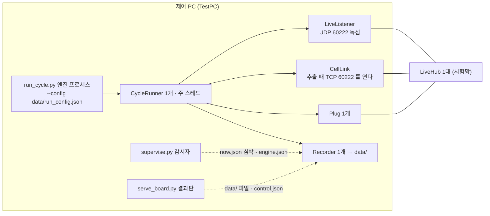
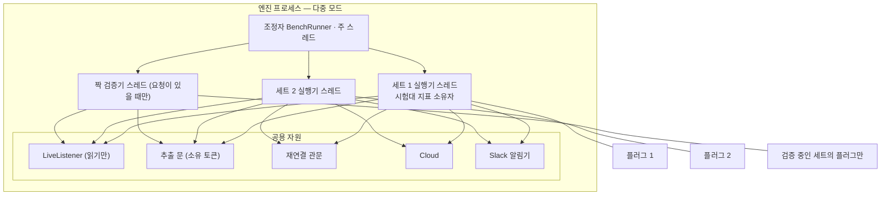
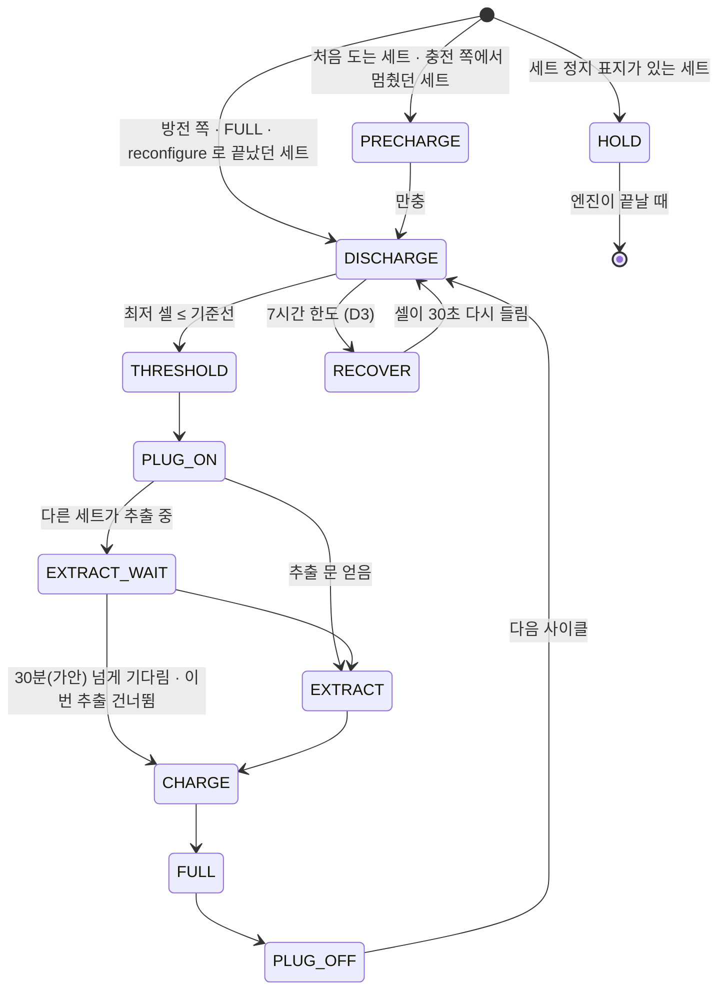
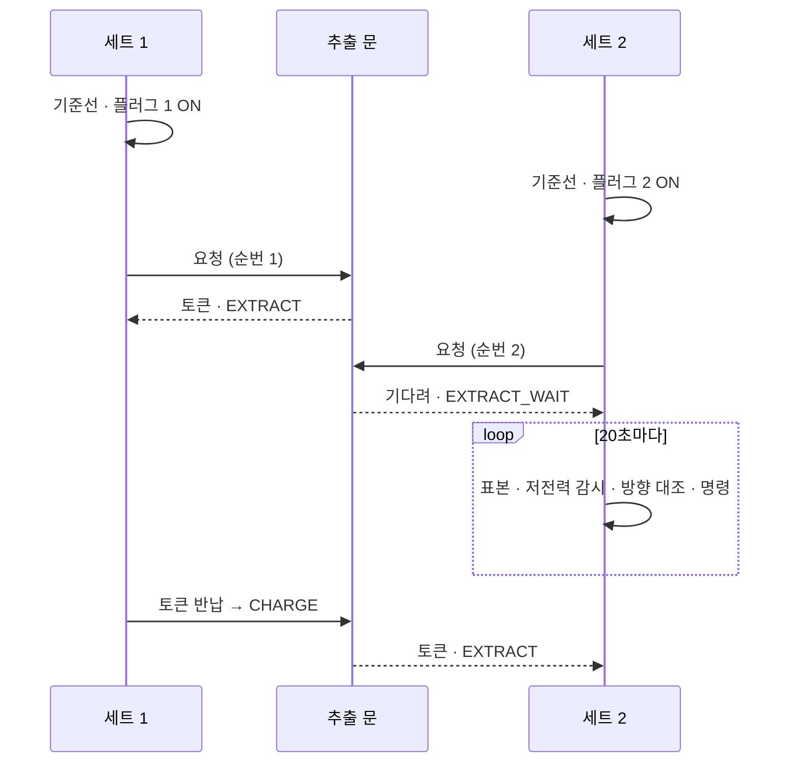
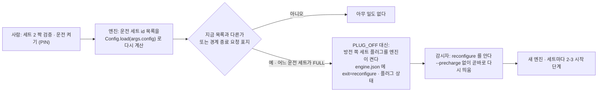
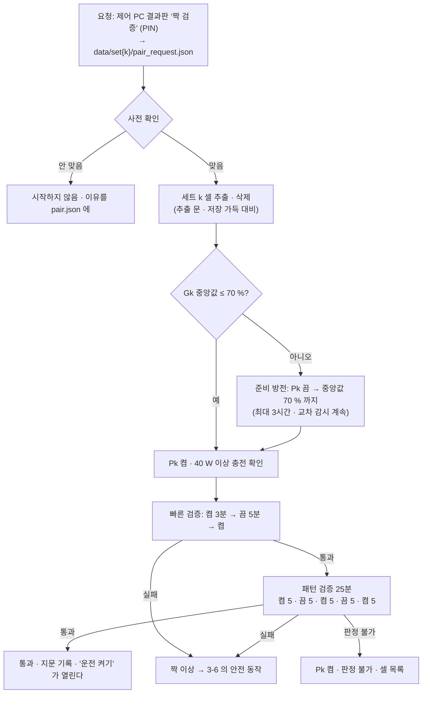

# 다중 세트 운전 — 설계 명세서 (v2)

> **한 줄 요지:** 정상 운전에서 세트 1 만 돌면 엔진은 지금 코드 길을 그대로 탄다. 다만 **고장일 때만 발동하는 안전 장치 셋**(방향 대조 · 방전 시작 대조 · 방전 7시간 한도)은 단일 모드에도 들어간다 — 안전이 '세트 1 동작 동일'보다 앞선다. 둘 이상이 돌면 조정자가 세트마다 지금의 사이클 실행기를 스레드로 돌리고, **짝 이상이 하나라도 보이면 실제 짝을 모르는 것이므로 모든 플러그를 켜고 모든 운전 세트를 세운다.**

- 상태: **v2 — 독립 검증 3건(안전 A · 하위 호환 B · 외부 전문가 패널 P) 반영본.** 코드 · 설정 · 데이터베이스는 아직 바꾸지 않았다.
- 결정의 정본: KimLead 결정 D1 ~ D15(이 명세에 반영)와 사용자 결정 대기 U1 ~ U6(9절 '결정 필요' — 답이 없을 때의 기본 동작으로 설계했다).
- 브랜치 `feat/multi-set-bench` (PR #5, Draft) · 기준 코드 `85ffca5` (이 PC 에서 검사 512건 통과).
- 낱말: 세트 = 스마트 플러그 1 · Dock 1 · 셀 24. **세트 1 = bench.json 에서 id 가 1 인 세트**(v1 의 '목록 첫 줄'에서 바꿨다 — A-L2). Gk = 세트 k 의 셀 무리. 신호등 낱말은 정상 · 경고 · 조치 · 신호 없음. 숫자 옆 **(가안)** = 실측이 아닌 추정, U2 보정 실측에서 정한다.

**v1 → v2 에서 바뀐 큰 것.** ① 짝 이상은 검증 때만이 아니라 **모든 단계 · 모든 모드에서** 본다(A-C1). ② 짝 이상의 안전 동작이 'Pk 만 켬'에서 **'모든 플러그 켬 + 모든 운전 세트 HOLD'** 로(A-C2). ③ 울타리를 **'모든 플러그 켬 + 엔진 재시작'** 으로 단순화(A-H2). ④ `--config`(run_config.json)로 도는 TestPC 를 전제로 세트 1 의 실효 설정과 재구성 판정을 다시 짰다(B-H1). ⑤ 마이그레이션 전 클라우드 오염을 막는다 — id 1 이 아닌 세트는 스키마 판 2 전까지 클라우드에 쓰지 않는다(B-H2). ⑥ 외부 `tools/pair_check.py` 를 없애고 보정 실측도 엔진 안에서 한다(B-H3).

---

## 0. 핵심 결정

1. **모드는 엔진이 시작할 때 정하고, 그 판정 열쇠는 engine.json 의 `mode` 하나다**(B-M6). 운전 목록이 세트 1 하나면 단일 모드(지금 길), 둘 이상이면 다중 모드(`BenchRunner` + 세트마다 `CycleRunner` 스레드).
2. **세트 k(id ≠ 1)는 다섯 관문을 모두 지나야 돈다** — bench.json 의 `run: true` · 짝 검증 통과(등록마다 바뀌는 nonce 를 넣은 지문 일치) · 클라우드 스키마 판 2 확인(U1) · 짝 판정 문턱 보정 끝(U2) · 세트 정지 표지 없음. 지금은 U1 · U2 가 열려 있으므로 **세트 2 는 돌 수 없다.**
3. **방향 대조 · 방전 시작 대조 · 방전 7시간 한도는 모든 모드의 모든 세트에 들어간다**(D2 · D3). 정상 운전에서는 발동하지 않고, 발동하면 플러그를 켜는 쪽으로만 움직인다.
4. **짝 이상의 안전 동작은 하나다 — 모든 플러그 켬 + 모든 운전 세트 HOLD + 사람 호출**(D2). 짝 하나가 틀렸다는 증거가 나오면 나머지 짝도 믿을 수 없기 때문이다.
5. **세트 하나의 일반 고장(플러그 무응답 · 셀 끊김 · 연속 실패)은 그 세트 안에 가둔다.** 스레드가 멈추면 부분 울타리 대신 **모든 플러그를 켜고 엔진을 다시 띄운다**(D9).
6. **세트 구성 변경은 어느 운전 세트든 만충 직후 경계에서 한다**(D6). 엔진은 끝내기 전에 방전 쪽 세트의 플러그를 스스로 켜고 끝내며, 감시자는 `reconfigure` 를 알아 예비 충전 없이 다시 띄운다.

---

## 1. 지금 구조 — 단일 세트 가정이 박힌 곳

지금 엔진은 프로세스 하나에 실행기 하나다. 셀 라이브 포트(UDP 60222)를 독점으로 열기 때문에(`cells.py:61-78`) 같은 PC 에 엔진을 둘 띄울 수 없고, 다른 프로세스는 엔진이 도는 동안 셀 배터리를 들을 수 없다. 그래서 다중 세트 · 짝 검증 · 보정 실측은 모두 **엔진 하나 안에서** 풀어야 한다.



| # | 자리 (파일:행) | 지금의 가정 | 다중에서 바뀌는 것 |
|---|---|---|---|
| 1 | `run_cycle.py:62` | Recorder 하나가 `data/` 에 쓴다 | 세트마다 Recorder (세트 1 = `data/`, 세트 k = `data/set{k}/`) |
| 2 | `run_cycle.py:92` · `plug.py:58-71` | Plug 하나. 먼저 `plug_ip_hint`(세트 1 주소)로 붙는다 | 세트마다 Plug. 세트 k 는 세트 1 의 주소를 물려받지 않는다(B-M10) |
| 3 | `run_cycle.py:101-103` | CellLink · CycleRunner 하나를 주 스레드에서 | 세트마다 스레드 + 공용 추출 문 |
| 4 | `run_cycle.py:78`, `140-153` | 비정상 종료 때 `plugs[0]` 만 켠다 | 엔진이 쥔 모든 플러그를 병렬로 |
| 5 | `run_cycle.py:130-137` | 목표 사이클 하나 | 세트별 고정 목표(완료 사이클만 센다) |
| 6 | `config.py:236-263` · `restart_at_boundary.ps1:25` | `--config` 파일(TestPC 는 `data/run_config.json`)의 `serials` · `plug_mac` · `sets` 가 bench.json 을 이긴다 | 세트 1 실효 설정 = 지금 cfg 그대로. 다중에서는 덮어쓴 값이 다른 세트와 겹치면 시작 거부(D12) |
| 7 | `config.py:277-344` | validate 가 `--config` 의 덮어쓴 값을 다른 세트와 비교하지 않는다 | 위 겹침 검사 · 세트 id 정수 1~5 · id 1 존재 |
| 8 | `cycle.py:105-107`, `264-296` | 실행기가 명령 통로를 직접 집는다 | 다중에서는 조정자가 집어 나눈다 |
| 9 | `cycle.py:305-307`, `845-852` | 안전 정지 = 엔진 전체 끝 | 세트 정지(기본) · 전체 정지(2차 확인) |
| 10 | `cycle.py:339-344`, `737-741` | 셀이 하나도 안 들리면 PC Wi-Fi 재연결 | 운전 세트가 모두 안 들릴 때만 |
| 11 | `cycle.py:493`, `642` · `cells.py:403-422` | 추출 · 대기 셀 깨우기가 TCP 60222 를 혼자 연다 | 공용 추출 문(소유 토큰) |
| 12 | `cycle.py:142-154` · `record.py:211-225` | now.json 하나 = 상태이자 감시자의 심박 | 세트마다 now.json, 다중이면 엔진 심박은 `data/beat.json` |
| 13 | `cycle.py:173-200`, `573-590` | metrics 에 세트 지표와 시험대 지표가 섞임 · 디스크 감시 | 시험대 지표는 세트 1 실행기만 |
| 14 | `cycle.py:840-843` | 연속 실패 = 엔진 전체 끝 | 그 세트만 HOLD |
| 15 | `cycle.py:609-618`, `669` · `guards.py:113-125` · `cycle.py:447-472` | 방전은 기준선에 닿을 때까지 시간 한도가 없다 · 무리 전체가 충전 중 내려가거나 방전 중 올라가는 것을 보는 검사가 없다 | 방향 대조 · 방전 시작 대조 · 방전 7시간 한도(모든 모드) |
| 16 | `record.py:181`, `207-209` | 알림 글에 세트가 없다 | id ≠ 1 세트의 글에만 '세트 k' |
| 17 | `cloud.py:155`, `190`, `202`, `290-345` | 행에 세트 없음 · '최신만'과 표본 간격이 종류 하나로 셈 · 명령은 `limit 1`(`cloud.py:333`) | (종류, 세트)로 셈 · set_id · 명령은 세트 수만큼 |
| 18 | `health.py:662-697`, `753-765` · `supervisor.py:609-613` · `serve_board.py:123-140` | 신호등이 now · cycles 하나로 판정 · 두 번째 세트부터 '대기' | 두 호출부가 세트별 재료를 넘긴다 |
| 19 | `supervisor.py:405-407`, `511-518`, `549-555` · `supervise.py:144-155` · `supervisor.py:64-66`, `305` | 플러그 켜기 · 지키기가 세트 1 · 끝난 이유에 `reconfigure` 가 없고 재시작은 늘 `--precharge` | 엔진이 쥔 세트마다 · `reconfigure` · 울타리 재시작 |
| 20 | `run_cycle.py:169-179` | 설정 오류 때 engine.json 을 새로 써 세트 정보가 사라진다 | 직전 `sets` 를 보존(B-L3) |
| 21 | `serve_board.py:171`, `224-270`, `408-421` · `register.py:130-133`, `142-177`, `347-354`, `381-382` | `/api/*` 가 `data/` 하나 · 운전 중 = 목록 첫 줄 · 등록 때 플러그 주소를 저장하지 않음 | `?set=k` · 운전 목록 · 주소 저장 |
| 22 | `board/index.html:794-834`, `900-914`, `1137-1142`, `1233-1288`, `2018` | 상태 하나 · 명령에 세트 없음 · 클라우드 질의에 set_id 없음 | 6절 |
| 23 | `20261008084739_bench_schema.sql:13`, `30`, `38`, `46`, `59` · `20261008120742_sample_buckets.sql:21` · `20261009235950_heartbeat_watch.sql:87` | 기본키 · 명령 종류 · 묶음 · 클라우드 심박이 시험대 단위 | 5절 마이그레이션 |

---

## 2. 목표 구조

### 2-1. 모드 판정 — 시작할 때 한 번

설정은 지금처럼 `Config.load(args.config)` 한 층으로 읽는다(코드 기본값 ← bench.json ← `--config`). 운전 목록은 그 결과에서 정한다.

```
세트 1 실효 설정 = 지금의 cfg 그대로 (--config 의 serials · plug_mac 덮어쓰기 포함, 22대여도 22대)
운전 목록 = [세트 1] + [세트 k | id ≠ 1, run = true, 짝 통과(지문 일치), 스키마 판 ≥ 2 확인, 보정 끝, 세트 정지 표지 없음]
목록이 하나 → 단일 모드 · 둘 이상 → 다중 모드  (engine.json 의 mode 에 적는다)
```

- **세트 1 의 실효 설정은 bench.json 의 세트 1 줄에서 다시 꺼내지 않는다**(B-H1). 그렇게 하면 run_config 로 22대를 도는 TestPC 의 세트 1 이 24대로 바뀌어 만충 판정이 영영 안 난다(`cycle.py:669` 의 `len(cfg.serials)`).
- 다중 모드에서 `--config` 의 `serials` · `plug_mac` 덮어쓰기는 세트 1 에만 적용하고, 다른 세트와 시리얼 · MAC 이 겹치면 시작을 거부한다(`exit=config_error`, D12). 단일 모드는 지금과 같다. engine.json `sets` 에 세트별 **실제** MAC · 시리얼을 적는다 — 감시자가 그 값으로 플러그를 켠다.
- 관문이 모자란 세트는 돌리지 않고 이유를 run.log 와 이상 `set_not_ready`(경고)로 **사유가 바뀔 때 한 번** 남긴다. 관문은 엔진 시작과 재구성 판정 때 다시 본다 — 한 번 실패로 영구 제외되지 않는다(A-L5).
- 클라우드 키가 없으면(클라우드 꺼짐) 스키마 판을 확인할 수 없으므로 세트 k 는 돌지 않는다. 원격 감시(FMEA P3) 없이 무인 세트를 늘리지 않는다 — v1 의 '꺼져 있으면 준비됨'은 지웠다(A-L5).
- 새 설정 키는 **bench.json 최상위에 두지 않는다**(B-M4). 옛 `Config.load` 는 모르는 최상위 키를 거부하므로(`config.py:252-254`), 새 키가 생기는 순간 옛 감시자가 깨진다. 세트별 키(`run` · `target_cycles` · `plug_ip` · `registered_at`)는 `sets` 의 각 줄 안에, 짝 · 안전 문턱은 코드 상수(`config.PAIR` · `config.SAFETY`, `HEALTH` 와 같은 꼴)로 둔다. 그래서 `cfg.dump()` 의 run.log 한 줄도 지금과 같다.
- validate 에 더하는 것: 세트 id 는 정수 1 ~ 5 · id 1 이 있다 · 세트 정지 표지와 run 의 모순 없음(B-L2).

### 2-2. 다중 모드의 프로세스와 스레드



조정자의 일은 여섯이다. 사이클 판정은 하지 않는다 — 그것은 지금처럼 `CycleRunner` 의 일이다.

1. **명령 나누기.** 모든 로컬 control.json 과 클라우드 표를 20초마다 집어 세트별 대기열에 넣는다. 클라우드는 한 번에 운전 세트 수만큼 가져온다(A-L4 — `limit 1` 이면 전체 정지가 줄을 선다).
2. **엔진 심박.** 20초마다 `data/beat.json` 에 엔진 심박과 세트별 심박을 쓴다.
3. **멈춤 감시.** 세트 실행기와 검증기의 심박을 본다. 실행기 심박이 600초(가안)를 넘게 멈춘 것이 **2회 연속**이면 울타리(4절). 검증기 심박이 멈추면 그 자리에서 Pk 를 켠다(A-H3).
4. **교차 감시.** 운전하지 않는 등록 세트와 검증 실패 세트의 셀 중앙값을 본다(3-6).
5. **짝 검증 요청**을 보고 검증기를 띄운다.
6. **끝내기.** 재구성 판정(2-8) · 경계 종료 요청 표지 · 모든 세트가 끝남.

단일 모드에서는 조정자가 없다. 위 3 의 '검증기 심박'과 5 는 세트 1 실행기의 표본 고리가 대신 본다(등록 세트가 둘 이상일 때만 — 7-1).

### 2-3. 세트별 상태기계

지금 단계(`cycle.py:28`)에 다중 모드에서만 쓰는 `EXTRACT_WAIT`(추출 대기)와 `HOLD`(세트 정지 — 플러그 ON 으로 지킴)를 더한다. 둘 다 플러그가 켜져 있어야 하는 단계로 `guards.PLUG_EXPECT`(`guards.py:26-27`)에 넣는다. 마지막 운전 세트가 세트 정지로 끝나면 단계 이름은 `STOPPED` 로 쓴다 — 클라우드 심박 함수가 '일부러 끝남'으로 알아보게(B-L4).



- **HOLD 로 가는 길:** 연속 실패 5번째(지금은 엔진 전체 끝 — `cycle.py:840-843`) · 세트 정지 · 짝 이상(모든 세트) · 스레드 예외 · 목표 도달(단계 이름 `DONE`).
- **HOLD 의 보호(D10, A-H1).** HOLD 는 지금의 복구 대기(`cycle.py:712-757`)에서 '셀이 돌아오면 끝냄'을 뺀 고리다. 그런데 하나의 긴 단계라 지금의 저전력 복구 한도(단계당 3번, `guards.py:75-85`)를 그대로 쓰면 3번 뒤 켜짐 · 1.5 W 로 방치된다. 그래서 HOLD 의 한도는 **시간당 다시 채워지고**, Gk 중앙값이 90 %(가안) 아래로 내려가면 끊었다 켠다 — Dock 은 만충 뒤 켜진 채로는 충전을 다시 시작하지 않기 때문이다(`plug.py:141-143`).
- **세트 정지의 지속(D1, A-H4).** 세트 정지는 `data/set{k}/hold`(세트 1 은 `data/hold`) 표지로 남아 엔진 재시작 · 재구성을 넘어 유지된다. 표지가 있는 세트는 시작 단계가 `HOLD` 다. 짝 이상으로 선 세트는 pair.json 을 '실패'로 덮어써 재검증을 강제한다.
- **시작 단계.** 마지막 now.json 단계가 방전 쪽(DISCHARGE · THRESHOLD · PLUG_OFF)이거나, FULL 이고 끝난 이유가 `reconfigure` 면 방전부터, 그 밖의 충전 쪽이면 예비 충전부터. 감시자가 `--precharge` 로 띄웠으면 모든 세트가 예비 충전부터. 단일 모드는 지금 규칙(`--precharge` 일 때만 예비 충전) 그대로.
- **엔진의 끝.** 운전 세트가 모두 HOLD · DONE 이면 엔진은 끝나고, 끝난 이유는 가장 무거운 것으로 적는다 — 연속 실패 · 짝 이상 · 스레드 예외가 하나라도 있으면 `failsafe`(감시자가 되살리지 않고 사람을 부른다, `supervisor.py:258-260`), 아니면 세트 정지가 있으면 `stopped`, 모두 목표 도달이면 `done`. 셋 다 플러그를 켜 두고 끝낸다.
- **목표 사이클(D7).** 세트별 고정 목표 `target_cycles`(기본 500). **완료 사이클만 센다** — cycles.csv 에서 방전 시작 · 만충이 모두 기록된 줄. 단일 모드는 지금처럼 `--cycles`.
- **안전 상태 체류 기록(D15).** HOLD · RECOVER 에 들어간 시각 · 나온 시각 · 이유를 세트 폴더의 `holds.csv` 에 남긴다(cycles.csv 와 따로).

### 2-4. 공용 자원과 잠금

| 자원 | 누가 쓰나 | 규칙 | 근거 |
|---|---|---|---|
| LiveListener (UDP 60222) | 실행기 · 검증기 · 조정자 | 하나, 스냅숏으로 읽기만 | `cells.py:61-78`, `137-139` |
| 추출 문 (TCP 60222 · LiveHub 대역) | 추출 · 대기 셀 깨우기 · 검증 전 추출 | 한 번에 하나. 먼저 요청한 쪽부터, 같은 순간이면 세트 id 순. 문은 **소유 토큰**(세트 · 시각)을 갖고, 쥔 실행기가 멈추면 울타리의 엔진 재시작으로 풀린다(D9, A-M4). 추출은 기다리고(EXTRACT_WAIT), 깨우기는 기다리지 않는다 | 두 세트가 동시에 `(pc_ip, 60222)` 를 `SO_REUSEADDR` 로 열면 접속을 누가 받을지 정해져 있지 않고, 묶음 밖 주소는 0x26 으로 돌려보내져(`cells.py:403-422`) 둘 다 깨진다 |
| 재연결 관문 (PC Wi-Fi) | 실행기의 `_watch_link` · `_recover` | 운전 중(HOLD 아님)인 세트가 **모두** 60초 넘게 안 들릴 때만, 2분 간격을 함께 센다 | 재연결은 PC 전체를 잠깐 끊는다(`cycle.py:342`) |
| 명령 통로 | 조정자 | 2-2 의 1 | `cloud.py:326-339` 는 시험대 전체에서 가장 오래된 것을 집는다 |
| Cloud | 모든 Recorder | 하나. '최신만'과 표본 간격을 (종류, 세트)로 센다 | `cloud.py:155`, `202`, `304-306` |
| 디스크 · 클라우드 지표 | 세트 1 실행기 | HOLD 고리에서도 계속 | `cycle.py:573-590` |
| `data/events.csv` · `run.log` | 세트 1 실행기 · 조정자 | Recorder 의 파일 쓰기에 잠금 | `record.py:142-153` |
| 플러그 | 세트마다 자기 것 | 잠그지 않는다. 세트 k 는 세트 1 주소(`plug_ip_hint`)를 쓰지 않고 등록 때 찾아 저장한 `plug_ip` 를 쓴다(D13) — 그래야 한 플러그에 두 실행기가 붙지 않는다 | `plug.py:58-71`, `87-109` · `register.py:347-354` |

**잠금 규칙(A-L3 반영 — v1 의 '전부 잎 잠금'은 틀렸다).** 추출 문 안에서 Recorder 의 심박 쓰기 잠금과 LiveListener 잠금을 잡는다(`run_cycle.py:96-101`, `cells.py:317`). 그래서 순서를 정한다: **추출 문 → Recorder → LiveListener.** 뒤의 잠금을 쥔 채 앞의 것을 잡지 않는다. 플러그 · 네트워크 호출은 추출 문 말고는 어떤 잠금도 쥔 채 하지 않는다. 모든 기다림에는 한도가 있다(추출 대기 30분, 스레드 합류 2분).

**멈춤 문턱(D9, A-H2).** 정상 실행기도 한 번에 약 290초 심박이 빌 수 있다 — 플러그 읽기 66초 + 재연결 30초 + 저전력 복구 약 160초 + 기다림 20초 + 명령 확인 10초. 그래서 실행기 멈춤 문턱은 600초(가안), 2회 연속 확인이다(감시자와 같은 방식, `supervisor.py:73`, `452-455`).

### 2-5. 왜 스레드인가

| 기준 | 세트마다 스레드 (채택) | 한 고리 틱 |
|---|---|---|
| 지금 코드 | `CycleRunner` 를 거의 그대로. 블로킹 고리 · 5분 추출이 그 스레드만 막는다 | 단계 함수 전부를 '한 틱' 단위로 다시 쓴다 |
| 세트 1 동일성 | 단일 모드는 지금 길 | 단일도 새 고리로 돌거나 두 벌 유지 |
| 고장 격리 | 플러그 66초 무응답이 그 세트만 막는다 | 모든 세트의 표본 · 안전망을 막는다 |
| 위험 | 경쟁 · 교착 → 2-4 의 잠금 규칙과 울타리 | 큰 재작성 |

실행기의 `time.sleep(poll_s)` 는 다중 모드에서 끊을 수 있는 기다림(`Event.wait`)으로 바꾼다 — Ctrl+C 는 주 스레드에만 온다. 검토 A 는 GIL · 잠금 없는 플러그 · 조정자 멈춤 처리를 반박하지 못했다(맞음 확인).

### 2-6. 우선순위와 추출 직렬화

기준선에 닿은 세트는 줄을 서지 않고 **곧바로** 자기 플러그를 켠다. 줄을 서는 것은 추출뿐이다. 기다리는 세트(EXTRACT_WAIT)는 표본 · 저전력 감시 · 방향 대조 · 명령을 계속 돈다. 최악의 기다림은 다른 넷의 추출(약 5분 × 4)이고, 30분(가안)을 넘으면 이번 추출을 건너뛰고(`extract_skipped`, 경고) 충전으로 간다. 셀 저장은 시간당 3.45 MB 라 한 사이클(약 21 MB)을 건너뛰어도 상한 160 MB 까지 여유가 있다(`config.py:133-134`). 방전 중 대기 셀 깨우기(`cycle.py:474-498`)는 문이 차 있으면 다음 표본에 다시 해 본다. 검토 A 는 동시 기준선 도달의 안전을 반박하지 못했다(맞음 확인).



### 2-7. 원격 명령의 길 (D1)

| 명령 | 세트 지정 | 단일 모드 | 다중 모드 |
|---|---|---|---|
| 플러그 켜기 · 끄기 | 없음 | 지금처럼 세트 1 | 버린다 — `manual_rejected`(경고) |
| 〃 | 세트 k | k = 1 이면 실행, 아니면 버린다(`manual_rejected`) | 세트 k 의 대기열. 운전 중이 아니면 버린다 |
| 안전 정지 | 없음 | 지금처럼 엔진 전체 정지 | 전체 정지 — 모든 플러그 ON, `exit=stopped` |
| 〃 | 세트 k | k = 1 이면 전체 정지와 같다(세트가 하나뿐). 운전 중 아닌 세트 지정은 버린다(`manual_rejected`, A-M2) | 세트 k 만 HOLD + 세트 정지 표지 |
| 세트 다시 켜기 (`resume_set`, 신규) | 세트 k | 세트 정지 표지를 지운다 — 다음 재구성 경계부터 돈다 | 같다 |

- 화면의 기본 단추는 '세트 k 정지'이고, '전체 정지'는 2차 확인 뒤에만 보낸다. 세트 다시 켜기는 폰(클라우드 결과판, 로그인)에서도 된다 — 둘 다 플러그를 켜는 쪽이라 위험이 늘지 않는다.
- 만료 규칙(엔진 시작 전에 보낸 명령은 버림, 시작 뒤 명령은 15분 한도 — `control.py:128-141`)은 그대로다.
- 서버는 운전 중이 아닌 세트로 가는 플러그 명령을 쓰기 전에 거부한다. 세트 1 과 지정 없는 명령은 `data/control.json`, 세트 k 는 `data/set{k}/control.json`.
- 클라우드 결과판은 bench_state 에 **최근 5분 안** 행이 있는 세트에만 명령 단추를 연다(A-M5) — 옛 엔진(set_id 를 모름)이 도는 동안 세트 k 명령이 세트 1 에서 실행되지 않게.

### 2-8. 세트 구성 바꾸기 — 경계에서 다시 시작 (D6)



- **판정 시점.** 운전 중(HOLD 아님)인 어느 세트든 FULL 에 닿을 때 — PLUG_OFF **전에** 판정한다. 그 세트는 만충 직후라 잃는 것이 없고, 플러그를 켠 채 끝낼 수 있다(B-M7). 세트 1 이 HOLD · DONE 이면 조정자가 20초 고리에서 판정한다.
- **비교 열쇠는 '운전 세트 id 목록'** 이고, 엔진과 같은 층(`Config.load(args.config)`)으로 다시 읽어 계산한다(B-H1). run_config 를 쓰는 TestPC 에서 bench.json 만 읽어 비교하면 단일 모드인데도 매 경계마다 다시 시작하게 된다.
- **엔진이 스스로 플러그를 켠다**(A-H7). 끝내기 전에 방전 쪽 세트의 플러그를 켜고(병렬, 30초 끊었다 켜기) 그 결과를 engine.json 에 적는다. 감시자에게 맡기지 않는다 — 감시자가 일시 중지(최대 2시간)거나 죽었으면 방전 중 플러그가 꺼진 채 남는다. 감시자 일시 중지 표지가 있으면 재구성을 미룬다.
- **경계 종료 요청 표지(D14, A-M3).** `tools/restart_at_boundary.ps1` 은 다중 모드에서 엔진을 죽이지 않고 `data/end_request` 표지만 놓는다. 엔진이 위와 같은 경계에서 플러그를 켠 뒤 끝낸다. 단일 모드에서 이 스크립트는 지금처럼 동작한다.
- **`reconfigure` 를 내는 엔진 코드와 그것을 아는 감시자 코드는 같은 단계에 들어간다**(8절 7단계). 옛 감시자는 `reconfigure` 를 모르는 끝으로 보고 `dead` → `--precharge` 재기동을 하기 때문이다(`supervisor.py:64-66`, `305`).
- 다중에서 다시 시작하면 FULL 이 아니던 세트는 사이클 중간일 수 있다. 그 세트는 시작 단계 규칙대로 이어 가고, 끊긴 사이클은 `note=reconfigure` 한 줄로 남는다.

---

## 3. 짝 검증과 방향 대조

### 3-1. 무엇을 막나

짝이 틀리면 — bench.json 은 세트 k = 플러그 Pk · 셀 Gk 인데 실제로는 Pk 가 다른 Dock 을 먹이면 — 셀이 0 % 로 가는 길이 둘 생긴다.

1. **방전이 끝나지 않는다.** 세트 j 가 방전 단계인데, 그 Dock 을 먹이는 Pk 가 켜져 있으면 Gj 가 올라가 기준선에 닿지 않는다. 지금 코드는 방전 중 '자기 플러그가 켜졌나'만 보므로(`cycle.py:447-472`) 이것을 모른다. 방전 시간 한도도 없다.
2. **충전 중인데 내려간다.** 세트 k 가 기준선에서 Pk 를 켜도 Gk 의 Dock 은 꺼진 채라 Gk 가 계속 내려간다. 만충 판정은 24대 100 % 가 필요해 나지 않고(`cycle.py:669`), 접촉 불량 판정은 무리 중앙값 비교라 무리 전체 하락을 못 잡고(`guards.py:113-125`), 저전력 감시는 남의 Dock 전력을 보고 정상이라 한다. 충전 한도 4시간보다 30 → 0 % 약 90분이 먼저 온다.

v1 은 이것을 '방전 시작 30분 창' 하나로만 보았고, 짝 이상 때 Pk 만 켰다. Pk ↔ Pj 가 서로 바뀐 경우 Pk 만 켜면 세트 j 의 방전이 끝나지 않아 Pj 가 계속 꺼지고, Pj 에 물린 Dock k 의 셀(운전하지 않으면 아무도 안 본다)이 0 % 로 간다(A-C2). v1 의 "셀이 0 % 로 가는 길은 없다"는 **틀렸다.**

그래서 v2 는 두 겹이다 — **운전 전에 짝을 검증하고(3-2 ~ 3-5), 운전 중에는 모든 단계에서 방향을 대조한다(3-6).** 어느 쪽이든 이상이 나면 모든 플러그를 켠다.

### 3-2. 짝 검증 절차 (D4)

검증기는 **엔진 안에서만** 돈다(UDP 포트 독점). v1 의 외부 `tools/pair_check.py` 는 없앴다 — 끔 구간에서 죽으면 아무도 Pk 를 켜지 않기 때문이다(A-H3).



- **사전 확인.** 세트 k 가 등록돼 있고 운전 목록에 없다 · Gk 24대가 모두 15초 안에 들리고 대기 모드가 아니다 · Pk 를 읽을 수 있다 · 다른 검증이 돌지 않는다 · 운전 세트 중 HOLD · RECOVER 가 없다 · U2 보정이 끝났다(또는 이번 실행이 보정 실측 자체다).
- **검증 전 추출 · 삭제(B-M1).** 운전하지 않는 세트의 셀은 지워 주는 사람이 없어 약 46시간이면 저장이 가득 차 측정 · 라이브가 멈추고 0x26 으로 돌아오지 않는다(`config.py:124-134`). 세트 2 장비는 10-10 부터 시험망에 있다(`config.py:151`). 그래서 검증 첫 단계가 지금의 추출 · 삭제(신원 확인 포함)다.
- **준비 방전 목표 70 %**(P②). 표시가 100 % 근처에 머무는 구간을 피하고, 켬 · 끔 기울기가 둘 다 뚜렷한 구간에서 잰다.
- **검증기 심박.** 검증기는 10초마다 심박을 쓴다. 조정자(단일 모드에서는 세트 1 실행기의 표본 고리)가 멈춘 것을 보면 그 자리에서 Pk 를 켠다. 검증 중인 세트는 engine.json `verifying` 에 세트 · MAC 과 함께 적혀, 비정상 종료 길과 감시자가 Pk 도 켠다(그 감시자 코드는 같은 단계에 들어간다 — B-L6).
- 어떤 길로 끝나든 Pk 를 켠 채(30초 끊었다 켜기, 40 W 확인) 끝낸다. 검증 동안의 소모(준비 방전 · 검증 %p)는 pair.json 에 남긴다(D15).

### 3-3. 판정식

**표기.** b_c(t) = 셀 c 의 라이브 배터리(정수 %), 10초마다 적는다. s_c(W) = 구간 W 의 최소제곱 기울기(%/분). 기대 크기: 충전 +0.35 ~ +0.47 %/분(사이클 1 · 2 만충 199 · 148분), 방전 −0.34 %/분(100 → 30 % 약 3.4시간), 10-08 실측 정상 방전 5분에 2 %p. **문턱은 전부 가안이다 — U2 보정 실측 전에는 세트 k 운전 켜기가 열리지 않는다.**

| 검증 | 재는 것 | 통과 (모두) | 실패 |
|---|---|---|---|
| 빠른 (켬 3 · 끔 5분) | r_c = s_c(켬) − s_c(끔) | ① Gk 의 r 중앙값 ≥ 0.30 ② Gk 중 r ≥ 0.15 인 셀 ≥ 20대 ③ 다른 무리마다 r 중앙값 < 0.10 | ③ 이 깨지면 Pk 가 남의 Dock 을 먹인다. ①② 가 깨지면 Pk 가 Dock k 를 먹이지 않는다. 둘 다 짝 이상 |
| 패턴 (25분) | 구간 w(5분씩 다섯)마다 s_c,w 와 플러그 상태 p_w 의 상관 ρ_c, 그리고 켬 구간 평균 − 끔 구간 평균 Δ_c | **'따른다' = ρ_c ≥ 0.8 이고 Δ_c ≥ 0.3 %/분.** 기울기를 못 구한 셀(NaN)은 '따르지 않는다'(A-M7). ① Gk 모두 따른다 ② Gk 밖에서 따르는 셀이 없다 | ① 을 못 넘은 셀 = 다른 Dock 에 꽂혔거나 시리얼이 틀림. ② 를 넘은 셀 = 이 Dock 에 꽂혔는데 다른 세트 · 미등록으로 적힘 |

- v1 의 '② Gk 밖 모든 셀 ρ < 0.5' 는 구간이 다섯뿐이라 우연히 ρ > 0.5 일 확률이 약 0.2 여서, 밖의 셀 100대면 약 20대가 늘 걸린다(A-M7). 상관에 **크기(Δ)** 를 함께 요구해 우연을 걸러낸다.
- 95 % 이상인 셀은 '판정 불가'로 빼고, 2대를 넘으면 검증 전체가 '판정 불가'.
- **판정 함수는 갈아 끼울 수 있게 둔다**(U6). 라이브 `state` 바이트(`protocol.py` offset 53)가 충전 중을 알린다고 확인되면, 기울기 대신 그것으로 몇 분 안에 판정하는 함수로 바꾼다.

### 3-4. 언제 필수인가 (D5)

| 때 | 짝 검증(빠른 + 패턴) | 방향 대조 (3-6) |
|---|---|---|
| 세트 k 를 처음 운전하기 전 · 짝 지문이 바뀐 뒤 · 짝 이상으로 선 뒤 | 필수 | 운전하는 동안 늘 |
| 세트 1 | **면제** — 증거: cycles.csv 에 만충(`full_at`)이 있고 note 가 `charge_timeout` 이 아닌 완료 사이클이 1줄 이상(플러그를 켠 뒤 만충으로 끝났다 = 그 플러그가 그 셀의 Dock 을 먹인다, A-L1). 증거가 없으면 세트 1 도 검증 대상 | 단일 모드 포함 늘 |

**짝 지문(D11, A-H5)** = 플러그 MAC(대문자) · 정렬한 시리얼 · 등록 시각 `registered_at`(등록마다 바뀌는 값)을 이은 글의 SHA-256 앞 16자. 해제 후 같은 짝으로 재등록해도 지문이 달라 옛 '통과'가 쓰이지 않는다. 해제할 때 `data/set{k}/` 는 `data/archive/set{k}-<시각>/` 로 옮겨, 새 세트가 옛 now.json 의 단계로 시작하지 않게 한다.

### 3-5. 보정 실측 (U2, B-H3)

엔진이 도는 동안 다른 프로세스는 셀을 들을 수 없으므로, 보정은 **엔진 안의 '기록 전용' 검증기**로 한다. 판정을 내리지 않고, 3-2 의 같은 절차를 돌며 모든 들리는 셀의 b_c(t) 와 플러그 상태 · 전력을 `data/set{k}/calib_<시각>.csv` 에 적는다. 계획(약 2.5시간): 잔량 두 구간(중앙값 약 70 % · 약 40 %)에서 끔 · 켬 반복, 그리고 정상 짝으로 패턴 검증 1회 통과. 이 결과로 3-3 과 3-6 의 가안 문턱을 정하고, 정한 값과 근거를 이 명세에 적은 뒤에야 세트 k 운전 켜기가 열린다. 세트 1 은 건드리지 않는다.

### 3-6. 방향 대조 — 모든 단계, 모든 모드 (D2 · D3)

| 대조 | 언제 | 짝 이상으로 보는 조건 (가안) |
|---|---|---|
| (a) 충전 쪽 하락 | PLUG_ON 뒤 20분부터 EXTRACT_WAIT · CHARGE · HOLD 동안 | 자기 플러그가 충전 전력(≥ `plug_on_min_w` 40 W)을 끄는데 20분 창 안에서 Gk 중앙값이 2 %p 넘게 하락. Dock 저전력 멈춤(약 1.5 W)은 전력이 낮아 여기서 빠진다 — 그것은 지금의 저전력 복구 몫이다 |
| (b) 방전 중 상승 | DISCHARGE | 20분 창 안에서 Gk 중앙값이 2 %p 넘게 상승 |
| (c) 방전 시작 대조 | DISCHARGE 시작(플러그 끔)부터 30분 | 30분 안에 Gk 중앙값이 3 %p 내려가지 않음 |
| (d) 남의 세트 교차 | 엔진이 어떤 플러그를 끈 뒤 30분 | 운전하지 않는 등록 세트 · 검증 실패 세트의 셀 중앙값이 2 %p 넘게 하락했고, **끄기 전 30분에는 하락하지 않았다** |
| 방전 7시간 한도 (D3) | DISCHARGE | 기대(약 3.4시간)의 2배인 7시간에 기준선에 닿지 않음 → 짝 이상이 아니라 **그 세트 RECOVER**(플러그 ON) + `discharge_timeout`(조치) |

- **짝 이상의 안전 동작(D2, A-C2).** (a) ~ (d) 중 하나라도 나면 실제 짝을 모르는 것이다. 엔진은 **등록된 모든 세트의 플러그를 켜고**(병렬), 다중 모드면 모든 운전 세트를 HOLD 로 보내고, 단일 모드면 플러그를 켠 채 `exit=failsafe` 로 끝낸다(감시자가 되살리지 않고 사람을 부른다). 이상 `pair_mismatch`(조치 · Slack) 하나에 무엇이 어떻게 움직였는지 적고, 관련 세트의 pair.json 을 '실패'로 덮어쓴다.
- (d) 의 '끄기 전 30분 하락 없음' 조건은 D2 의 '하락이 보이면'을 좁힌 것이다. 사람이 일부러 꺼 둔 운전하지 않는 세트는 늘 내려가고 있으므로, 그 조건이 없으면 엔진의 정상적인 끄기 때마다 모든 세트가 선다.
- 10-08 실측으로 정상 방전은 5분에 2 %p 내려가므로 (b) · (c) 의 오탐 여지는 작다. 그래도 단일 모드의 세트 1 에 들어가는 장치이므로 **TestPC 의 실제 기록을 다시 흘려 오탐 0 을 확인한 뒤**(G12) 들인다.

### 3-7. 검증이 운전 중인 세트에 주는 영향

검증기는 Pk 하나만 만지고, 다른 세트의 플러그 · 재연결 관문을 쓰지 않는다(추출 문은 검증 전 추출에만, 순서를 지켜). 짝이 맞으면 운전 세트는 아무 일도 겪지 않는다. Pk 가 운전 세트 j 의 Dock 을 먹이는 경우, 검증의 끔 구간(빠른 5분)에 j 의 Dock 이 꺼지고 ③ 이나 (d) 가 잡아 **모든 플러그를 켠다** — j 는 몇 %p 덜 차고 그 사이클 기록이 흐려진다. 준비 방전(최대 3시간) 중에는 (d) 가 30분 창으로 잡는다. j 가 만충이면 표시가 100 % 에 머물러 못 볼 수 있으나, 그때 j 는 덜 찬 채 다음 방전을 시작할 뿐이고 그 방전에서 (c) 가 잡는다.

---

## 4. 고장 모드 — 세트 범위로 갇히나

| 고장 | 누가 알아채나 | 무엇을 하나 | 범위 | 단일 모드 |
|---|---|---|---|---|
| 세트 k 플러그 무응답 | 그 실행기 (3번 재시도 → `plug`, 경고) | 다음 표본에 다시. 충전 쪽이면 저전력 복구가 켜기를 되풀이(`cycle.py:383-426`) | 세트 k | 같다 |
| 시작 때 세트 k 플러그 읽기 실패 | 조정자의 세트 단위 try (A-M1) | 그 세트만 `set_not_ready` · 다음 재구성 때 다시. 엔진 전체를 끝내지 않는다(`run_cycle.py:92-94` 는 지금 끝낸다) | 세트 k | 같다 (세트 1 실패는 지금처럼 끝) |
| 세트 k 셀 전부 끊김 | 그 실행기 | 재연결은 운전 세트가 모두 안 들릴 때만. 5분 뒤 그 세트 RECOVER | 세트 k | 같다 |
| Dock 충전 멈춤 (켜짐 · 1.5 W) | 그 실행기의 저전력 복구 | 그 세트 플러그만 30초 끊었다 켬 (HOLD 는 시간당 다시 채워지는 한도) | 세트 k | 같다 |
| 짝 이상 · 교차 연결 | 방향 대조 (a) ~ (d) | **모든 플러그 켬 + 모든 운전 세트 HOLD** | 전체 (짝을 모르므로) | 플러그 켬 + `exit=failsafe` |
| 방전이 7시간 넘음 | 그 실행기 | 그 세트 RECOVER + `discharge_timeout`(조치) | 세트 k | 같다 (새 장치) |
| 세트 k 연속 실패 5번째 | 그 실행기 | 그 세트만 HOLD + `set_hold`(조치) | 세트 k | 지금처럼 엔진 끝 |
| 스레드 예외 | 스레드 감싸개 | 그 세트 플러그 켬 + HOLD | 세트 k | 없다 |
| 실행기 멈춤 (600초 × 2회) | 조정자 | **울타리 = 모든 플러그 켬(병렬) + 감시자가 되살리는 끝(`exit=fenced`)으로 엔진 재시작**(D9). 추출 문 토큰도 이 재시작으로 풀린다 | 전체 (재시작 몇 분) | 지금처럼 감시자 |
| 검증기 멈춤 | 조정자 · 세트 1 실행기 | 그 자리에서 Pk 켬 · 검증 '판정 불가' | 세트 k | 같다 |
| 엔진 크래시 · 강제 종료 | atexit · 감시자 | 엔진이 쥔 모든 플러그(운전 + 검증)를 **병렬로** 끊었다 켬(A-L6) · `--precharge` 로 다시 띄움 | 전체 | 플러그가 여럿일 뿐 같다 |
| 설정 오류로 시작 거부 | run_cycle | engine.json 의 직전 `sets` · `verifying` 을 보존하고 `exit=config_error` — 감시자가 그 플러그들을 켠다(B-L3) | 전체 | 세트 정보 보존만 다르다 |
| 조정자 멈춤 | 감시자 (beat.json) | 엔진을 끝내고 모든 플러그 켬 → 다시 띄움 | 전체 | 다중만 |
| LiveHub · Wi-Fi 끊김 | 모든 실행기 | 공용 재연결 하나 · 5분 뒤 모든 세트 RECOVER | 전체 | 같다 |
| 재구성 경계 | 엔진 | 방전 쪽 플러그를 엔진이 켜고 끝낸다. 감시자 일시 중지면 미룬다 | 전체 | 운전 목록이 바뀔 때만 |
| 원격 명령이 엉뚱한 세트로 | 서버 · 조정자 · 결과판 | 2-7 | 지정한 세트 | 2-7 |

---

## 5. 기록 · 클라우드

### 5-1. 로컬 파일 배치

| 무엇 | 세트 1 (id 1) | 세트 k (id ≠ 1) |
|---|---|---|
| `cycles.csv` · `events.csv` · `samples_NNNN.csv` · `cells_NNNN.csv` · `discharge_NNNN.csv` · `ftg/NNNN/` · `now.json` · `plug_stats.json` · `control.json` · `control_ack.json` · `run.log` | `data/` — **지금 그대로** | `data/set{k}/` — 같은 이름 |
| `holds.csv` (HOLD · RECOVER 체류, D15) · `hold` (세트 정지 표지) | `data/` — 고장 · 정지 때만 생긴다 | `data/set{k}/` |
| `pair.json` · `pair_request.json` · `calib_<시각>.csv` | 없다 (면제 증거가 있을 때) | `data/set{k}/` |
| 시험대 전체: `engine.json` · `supervisor.*` · `health.json` · `osinfo.json` · `plugs.json` · `alert_*.json` · `supervisor_pause` · `run_config.json` | `data/` — 지금 그대로 | — |
| `beat.json` · `end_request` | 다중 모드에서만. 단일 모드로 시작하면 낡은 `beat.json` 을 지운다(B-M6) | — |
| 해제된 세트 | — | `data/archive/set{k}-<시각>/` 로 옮긴다(D11) |

- 폴더 규칙은 "id 1 = `data/`, 나머지 = `data/set{id}/`" 하나이고, 코드에서는 `set_dir(cfg, id)` 한 곳에서 계산한다. 세트 설정 보기의 `data_dir` 이 그 폴더라 Recorder · 추출 폴더(`cycle.py:642`) · 플러그 통계(`run_cycle.py:92`) · 명령 파일(`cycle.py:105`)이 따라간다.
- 시험대 전체 이상(재연결 · 디스크 · 클라우드 실패 · 세트 지정 없는 명령)은 지금처럼 `data/events.csv` 에 세트 1 의 사이클 · 단계로 남는다.
- engine.json 은 정상 단일 모드에서 지금과 같다. 다중 모드 · 검증 중 · 재구성 끝에서만 `mode` · `sets`(세트별 id · 실제 MAC · 시리얼 · 목표) · `verifying` · `plugs_on_exit` 이 붙는다.
- 알림 글은 **id ≠ 1 세트에만** '세트 k' 를 붙인다(B-H2). 세트 1 의 글은 모드와 상관없이 지금 그대로다.

### 5-2. 클라우드 요청의 두 모양 (D8)

| 스키마 판 | 세트 1 의 요청 | 세트 k 의 기록 |
|---|---|---|
| 1 (함수 없음 · 탐침 실패 · 아직 모름) | **지금 그대로** — set_id 없음 · `on_conflict=bench_id` 등 | **클라우드에 쓰지 않는다**(`NoCloud`). 마이그레이션 전 검증 결과가 세트 1 의 행(bench_state 를 덮어씀, `cloud.py:293`)이나 이상으로 섞이지 않게(B-H2) |
| 2 이상 | 본문에 `set_id`, on_conflict 에 set_id. 행의 값은 같다(set_id = 1 = 기본값) | set_id = k 로 쓴다 |

- **탐침은 Cloud 의 작업 스레드에서** RPC `bench_schema_version()` 을 부른다. 단일 모드의 시작 길에는 네트워크 호출이 없다. 탐침 실패는 판 1 이고, 전송 실패 수에 넣지 않는다.
- 400 계열 중 **42P10 · PGRST204 · 42703** 이 오면 재탐침한다(마이그레이션 적용 · 되돌림 모두). 요청 모양은 넣을 때가 아니라 **보낼 때** 정한다 — 재시도가 새 판으로 나가 버려지는 것이 없다.
- 감시자의 Cloud(`supervise.py:102-108`, 신호등 전송)도 같은 탐침을 한다 — 7-2 에 적었다.
- 엔진은 now.json(그래서 bench_state payload)에 `cloud_schema`(이 엔진이 아는 판)를 싣는다. 마이그레이션 적용 절차의 첫 줄이 클라우드에서 그 값이 2 를 아는 엔진인지 확인하는 것이다(A-M5, B-M4).
- '최신만'과 표본 간격은 (종류, 세트) 열쇠로 센다. 보낼 일 상한은 500 × 운전 세트 수(가안).

### 5-3. 마이그레이션 초안 SQL — 적용하지 않는다

대상은 Supabase 프로젝트 cell-bench(`rmlxafxegabeqqtuvyyb`) 하나뿐이고 그것이 운영 환경이다. 적용 시험은 Supabase 브랜치 DB 나 로컬 Supabase 스택에서 한다 — 이 SQL 은 `auth.email()` · 역할 · pg_cron · pg_net · vault 가 있어야 돌아서 맨 Postgres 로는 안 된다(B-M9). 둘 다 없으면 '미검증'으로 남기고 적용은 사용자 승인(U1)으로 정한다. 적용 도구가 트랜잭션을 감싸므로 `begin` · `commit` 은 넣지 않는다(B-L5). 파일 이름은 구현 때 `date -u +%Y%m%d%H%M%S` 로 짓는다.

```sql
-- 다중 세트 — 측정 표에 세트 칸을 더하고 세트마다 행이 갈리도록 기본키를 바꾼다. 기존 행은 모두 set_id = 1.

-- 1) 세트 칸
alter table public.bench_state     add column if not exists set_id smallint not null default 1 check (set_id between 1 and 5);
alter table public.bench_sample    add column if not exists set_id smallint not null default 1 check (set_id between 1 and 5);
alter table public.bench_cycle     add column if not exists set_id smallint not null default 1 check (set_id between 1 and 5);
alter table public.bench_discharge add column if not exists set_id smallint not null default 1 check (set_id between 1 and 5);
alter table public.bench_event     add column if not exists set_id smallint not null default 1 check (set_id between 1 and 5);
alter table public.bench_command   add column if not exists set_id smallint check (set_id between 1 and 5);  -- null = 지정 없음

-- 2) 기본키
alter table public.bench_state     drop constraint bench_state_pkey,     add primary key (bench_id, set_id);
alter table public.bench_sample    drop constraint bench_sample_pkey,    add primary key (bench_id, set_id, t);
alter table public.bench_cycle     drop constraint bench_cycle_pkey,     add primary key (bench_id, set_id, cycle);
alter table public.bench_discharge drop constraint bench_discharge_pkey, add primary key (bench_id, set_id, cycle, serial);
create index if not exists bench_event_set_t on public.bench_event (bench_id, set_id, t desc);

-- 3) 명령 종류에 '세트 다시 켜기'
alter table public.bench_command drop constraint if exists bench_command_cmd_check;
alter table public.bench_command add constraint bench_command_cmd_check check (cmd in ('plug_on', 'plug_off', 'stop_safe', 'resume_set'));

-- 4) 표본 묶음 — 반환 칸이 바뀌어 뷰 → 함수 순으로 지우고 다시 만든다
drop view if exists public.bench_sample_10m;
drop view if exists public.bench_sample_1h;
drop function if exists public.bench_sample_bucket(int);
create function public.bench_sample_bucket(bucket_s int)
returns table (bench_id text, set_id smallint, t timestamptz, cycle int, phase text, plug_on boolean, watts numeric,
               wh numeric, batt_min int, batt_avg numeric, batt_max int, cells_alive int, n int)
language sql stable security invoker as $$
  select bench_id, set_id, to_timestamp(floor(extract(epoch from t) / bucket_s) * bucket_s),
         min(cycle), mode() within group (order by phase), bool_or(plug_on), round(avg(watts)::numeric, 2), max(wh),
         min(batt_min)::int, round(avg(batt_avg)::numeric, 1), max(batt_max)::int, min(cells_alive)::int, count(*)::int
  from public.bench_sample
  group by bench_id, set_id, 3
$$;
create view public.bench_sample_10m with (security_invoker = true) as select * from public.bench_sample_bucket(600);
create view public.bench_sample_1h  with (security_invoker = true) as select * from public.bench_sample_bucket(3600);
grant select on public.bench_sample_10m, public.bench_sample_1h to anon, authenticated;
grant execute on function public.bench_sample_bucket(int) to anon, authenticated;

-- 5) 클라우드 심박 — 시험대 단위로 묶어 본다. 바뀐 곳은 고리의 머리와 '일부러 끝남' 조건(10분 안에 갱신된 세트만)뿐이다
create or replace function public.bench_heartbeat_check()
returns void language plpgsql security definer set search_path = '' as $$
declare
  stale    constant interval := interval '5 minutes';
  renotify constant interval := interval '60 minutes';
  hook text; r record; w public.bench_watch%rowtype; mins int; last_kst text; msg text;
begin
  begin
    select ds.decrypted_secret into hook from vault.decrypted_secrets ds where ds.name = 'cell_bench_slack_webhook' limit 1;
  exception when others then hook := null;
  end;
  for r in
    select b.bench_id, max(b.updated_at) as updated_at,
           (array_agg(b.cycle order by b.set_id))[1] as cycle,
           (array_agg(b.phase order by b.set_id))[1] as phase,
           bool_and(coalesce(b.phase, '') in ('DONE', 'STOPPED'))
             filter (where b.updated_at >= b.last_at - interval '10 minutes') as ended
      from (select s.*, max(s.updated_at) over (partition by s.bench_id) as last_at from public.bench_state s) b
     group by b.bench_id
  loop
    insert into public.bench_watch (bench_id) values (r.bench_id) on conflict (bench_id) do nothing;
    select * into w from public.bench_watch where bench_id = r.bench_id for update;
    msg := null;
    mins := floor(extract(epoch from (now() - r.updated_at)) / 60)::int;
    last_kst := to_char(r.updated_at at time zone 'Asia/Seoul', 'MM-DD HH24:MI') || ' KST';
    if r.updated_at < now() - stale and not coalesce(r.ended, false) then
      if w.state <> 'lost' then
        update public.bench_watch set state = 'lost', lost_since = r.updated_at, last_notified_at = now(), updated_at = now()
         where bench_id = r.bench_id;
        insert into public.bench_event (bench_id, t, cycle, phase, kind, serial, detail)
        values (r.bench_id, now(), r.cycle, r.phase, 'heartbeat_lost', '-',
                format('시험대 PC 소식 없음 — 마지막 갱신 %s (%s분 전)', last_kst, mins));
        msg := format('[셀 시험대 %s] 미확인 · 클라우드 감시 · 시험대 PC 에서 %s분째 소식 없음 (마지막 갱신 %s) — PC 전원·인터넷·시험 프로그램 확인',
                      r.bench_id, mins, last_kst);
      elsif w.last_notified_at is null or w.last_notified_at <= now() - renotify then
        update public.bench_watch set last_notified_at = now(), updated_at = now() where bench_id = r.bench_id;
        msg := format('[셀 시험대 %s] 미확인 (계속 · %s분째 · 60분마다) · 클라우드 감시 · 시험대 PC 소식 없음 (마지막 갱신 %s)',
                      r.bench_id, mins, last_kst);
      end if;
    elsif w.state = 'lost' then
      mins := floor(extract(epoch from (r.updated_at - coalesce(w.lost_since, r.updated_at))) / 60)::int;
      update public.bench_watch set state = 'ok', lost_since = null, updated_at = now() where bench_id = r.bench_id;
      insert into public.bench_event (bench_id, t, cycle, phase, kind, serial, detail)
      values (r.bench_id, now(), r.cycle, r.phase, 'heartbeat_back', '-', format('시험대 PC 소식이 다시 들어옴 — %s분 만에', mins));
      msg := format('[셀 시험대 %s] 복구 · 클라우드 감시 · 시험대 PC 소식이 다시 들어옴 (%s분 만에)', r.bench_id, mins);
    end if;
    if msg is not null and hook is not null then
      begin
        perform net.http_post(url := hook, body := jsonb_build_object('text', msg),
                              headers := '{"Content-Type": "application/json"}'::jsonb, timeout_milliseconds := 5000);
      exception when others then raise warning 'cell-bench heartbeat: Slack 전송 실패 — %', sqlerrm;
      end;
    end if;
  end loop;
end;
$$;
revoke execute on function public.bench_heartbeat_check() from public, anon, authenticated;

-- 6) 스키마 판 — 엔진 · 감시자 · 클라우드 결과판의 탐침이 읽는다
create or replace function public.bench_schema_version() returns int language sql immutable as $$ select 2 $$;
grant execute on function public.bench_schema_version() to anon, authenticated, service_role;
notify pgrst, 'reload schema';
```

- `bench_command_cmd_check` 는 Postgres 가 인라인 check 에 붙이는 기본 이름이다 — 적용 시험에서 실제 이름을 확인한다(이름이 다르면 `drop constraint if exists` 가 아무것도 지우지 않아 옛 check 가 남고 `resume_set` 이 거부된다).
- RLS: 읽기 정책은 `using (true)`, 명령 넣기 정책은 `requested_by = auth.email()` 이라 행 조건이 없어 고치지 않는다. 검토 B 는 set_id 기본값 채움 · pkey 이름 · 옛 upsert 의 42P10 실패와 event insert 성공 · 묶음 재작성 · RLS 무변경 · 심박 번갈음 추론을 반박하지 못했다(맞음 확인).
- `bench_health` · `bench_watch` 는 시험대 단위로 둔다.
- **되돌리기.** 세트 2 이상의 행을 지워야 옛 기본키로 돌아간다(지운 행은 되살릴 수 없다). 순서: 각 표 `delete … where set_id <> 1` → 기본키 원래대로 → 명령 check 원래대로 → 묶음 뷰 · 함수를 지우고 `20261008120742_sample_buckets.sql` 재적용 → `20261009235950_heartbeat_watch.sql` 의 함수 재적용 → `drop function bench_schema_version()` → `drop column set_id`. 되돌린 뒤 엔진의 v2 요청은 PGRST204 로 실패해 재탐침으로 판 1 이 된다.

### 5-4. 적용 순서

| 순서 | 무엇 | 확인 |
|---|---|---|
| 1 | 이 브랜치의 코드를 TestPC 에 들인다 — **엔진 · 감시자 · 결과판 서버를 모두** 새 코드로(B-M4). 엔진은 사이클 경계에서 | 단일 모드 · 요청 모양 지금 그대로 |
| 2 | PR 머지 → 클라우드 결과판 배포(main 푸시마다 Vercel 이 `cell-bench/deploy/board` 를 올린다) | 결과판이 판 1 을 보고 거르지 않는다 |
| 3 | 새 코드가 단일 모드로 **한 사이클을 끝까지 돈 뒤**, 조용한 시점에 SQL 전문(심박 함수 포함)을 사용자에게 보이고 승인을 받아 적용(U1) | 첫 줄: bench_state payload 의 `cloud_schema` 가 2 를 아는 엔진인가 |
| 4 | 적용 뒤 세트 1 의 다음 전송이 재탐침으로 판 2 가 되었는지, 심박 경보가 없었는지 본다 | bench_state 에 set_id = 1 한 줄 |
| 5 | 그 뒤에야 세트 2 운전 켜기가 열린다(U2 보정도 끝났을 때) | — |

---

## 6. 결과판 · 신호등 · 원격 명령 화면 변경 목록

| 자리 (`board/index.html`) | 세트 1 만 운전 | 둘 이상 운전 |
|---|---|---|
| 관제 · 맵 · 세트 카드 (`900-914`, `1137-1200`) | 그대로 | 운전 세트마다 '운전' 카드. HOLD 는 조치색 '정지 · 플러그 ON · 사유'. EXTRACT_WAIT 는 '추출 대기 · 세트 j 추출 중' |
| 세트 상세 (`1473-1500`) | 그대로 | `?set=k`(로컬) · `set_id=eq.k`(클라우드)로 그 세트만 |
| 원격 명령 (`1233-1288`) | 그대로 | 기본 단추 '세트 k 정지'. '전체 정지'는 2차 확인 뒤. HOLD 세트에 '세트 다시 켜기'(PIN · 폰에서도). 확인 칸 첫 줄에 '대상: 세트 k' |
| 운전 대기 세트 (`1139-1142`, `1424-1470`, `1477`) | 문구만 — '짝 검증 전' · '짝 검증 통과 · 운전 꺼짐' · '운전 켜짐 · 다음 경계에서 시작' · '보정 실측 전 — 운전 켜기 잠김' | 같음 + '짝 검증' 카드(단계 · 진행 · r · ρ · Δ · 따르지 않은 셀 · 소모 %p). 단추 '짝 검증' · '멈춤' · '운전 켜기 / 끄기'(PIN, 제어 PC 만) |
| 등록 화면 (`register.py:38-39` · `index.html:2149`, `2166`) | '운전은 다중 세트 기능 적용 뒤' 문구를 '짝 검증을 통과하고 운전을 켜면 다음 경계에서 시작'으로. 같은 플러그 별명이 이미 있으면 경고(A-L8) | 같음 |
| 클라우드 결과판 (`794-834`) | 그대로 | **새로 고칠 때마다** 스키마 판을 탐침하고, 실패면 판 1(B-M2). 판 2 일 때만 **세트 칸이 있는 표와 뷰**(`bench_state` · `bench_sample` 과 묶음 뷰 둘 · `bench_cycle` · `bench_discharge` · `bench_event` · `bench_command`)에 set 필터, `bench_health` 질의는 그대로(그 표에는 set_id 가 없다). 지금 상태는 `rows[0]` 이 아니라 set_id 로 고른다. 명령 단추는 최근 5분 안 행이 있는 세트만 |

**신호등.** 세트 차선(플러그 · Dock·셀 · 셀 수신 · 사람 조작)은 운전 세트마다 그 세트의 now.json 으로 잰다. 재료를 넘기는 **두 호출부**를 함께 고친다 — 감시자 tick(`supervisor.py:405-407`, `609-613`)과 결과판 서버 `health_now`(`serve_board.py:123-140`)(B-M5). 9차선의 세트 차선 불은 가장 나쁜 세트의 것이고, id ≠ 1 세트의 이유 글 앞에 '세트 k · ' 를 붙인다. 세트 목록(`health.py:753-765`)은 운전 목록으로 가르고, 대기 문구(`health.py:757-758`)를 바꾼다 — 그 문구를 단언하는 `tests/test_health.py:456-457` 은 고쳐야 하며 PR 본문에 이유를 적는다(B-M8). `register.engine_claims` 도 운전 목록 전부를 본다.

**새 이상 종류.**

| 종류 | 불 | Slack | 뜻 |
|---|---|---|---|
| `pair_mismatch` | 조치 | 보냄 | 짝 검증 실패 · 방향 대조 (a) ~ (d) — 모든 플러그를 켰다 |
| `discharge_timeout` | 조치 | 보냄 | 방전 7시간 — 그 세트 RECOVER |
| `set_hold` | 조치 | 보냄 | 세트가 HOLD (연속 실패 · 스레드 예외) |
| `fenced` | 조치 | 보냄 | 실행기 멈춤 — 모든 플러그를 켜고 엔진을 다시 띄움 |
| `pair_check` | 경고 | 기록만 | 짝 검증 시작 · 통과 · 판정 불가 |
| `set_not_ready` | 경고 | 기록만 | run 은 켜졌는데 관문이 모자람 (사유가 바뀔 때 한 번) |
| `extract_skipped` | 경고 | 기록만 | 추출 대기 30분 넘어 건너뜀 |
| `manual_rejected` | 경고 | 보냄 | 세트 지정이 맞지 않는 명령을 버림 |
| `reconfigure` | 경고 | 보냄 | 세트 구성이 바뀌어 경계에서 다시 시작 |

**결과판 서버.** `GET /api/now · samples · cycles · events · discharge · cells · control` 는 `?set=k` 를 받고 없으면 지금처럼 `data/`. `POST /api/control {cmd, pin, set?}` 는 운전 중이 아닌 세트의 플러그 명령을 거부한다. 신규 `GET /api/pair?set=k` · `POST /api/pair {pin, set, action}` · `POST /api/run {pin, set, on}` — `/api/run` 은 등록 · 해제와 **같은 잠금**(`check_lock`)과 같은 쓰기 방법으로 bench.json 을 고치고, 끌 때는 엔진이 HOLD 를 알릴 때까지 화면이 '운전 중'으로 둔다(A-M6). 해제는 운전 중 · run 켜짐 · 검증 중 세트를 거부하고, 해제하면 세트 폴더를 보관 폴더로 옮긴다. 등록은 그때 찾은 플러그 주소를 `plug_ip` 로 저장한다(D13).

---

## 7. 하위 호환 — 정상 운전에서 세트 1 은 지금과 같다

### 7-1. 같음을 만드는 장치

1. **단일 모드는 지금 길이다.** `run_cycle.main` 이 Recorder · Plug · CycleRunner 하나를 주 스레드에서 돌리고(`run_cycle.py:62-105`), BenchRunner 는 만들지 않는다. 세트 1 실효 설정은 `--config` 를 포함한 지금 cfg 다.
2. **새 인자는 전부 '지금 동작'이 기본값**이다 — 추출 문 없음 · 재연결 관문 없음 · 명령 출처는 지금 통로 · 기다림은 `time.sleep` · 알림 머리 세트 없음 · 클라우드 세트 번호 없음.
3. **새 설정은 최상위 키가 아니다** — 세트별 키는 `sets` 의 줄 안, 문턱은 코드 상수. 그래서 run.log 의 설정 줄도 같다.
4. **단일 모드에서 정상 운전에 닿는 코드 변경은 셋이다**: (a) 세트 지정이 맞지 않는 명령을 버림, (b) 등록 세트가 둘 이상일 때만 짝 검증 요청과 검증기 심박을 봄, (c) 사이클 끝마다 운전 세트 id 목록을 `Config.load(args.config)` 로 다시 계산해 비교함. 세트 1 만 등록된 지금은 셋 다 아무 일도 하지 않는다.

### 7-2. 허용하는 차이 — 이것 말고는 없어야 한다

| 차이 | 언제 | 왜 받아들이나 |
|---|---|---|
| 방향 대조 (a) ~ (c) · 방전 7시간 한도 · 짝 이상 때 모든 등록 플러그 켬 + `exit=failsafe` | **고장일 때만** (정상 운전에서는 발동하지 않는다 — G12 로 확인) | 지금 코드에 없는 안전 울타리(D2 · D3). 안전 > 동작 동일 |
| `holds.csv` 가 `data/` 에 생긴다 | RECOVER · HOLD 에 들어갈 때만 | 안전 상태 체류 기록(D15) |
| now.json(그래서 bench_state payload)에 `cloud_schema` 한 칸 | 늘 | 마이그레이션 적용 순서를 확인하는 유일한 길(5-4) |
| 엔진 · 감시자의 Cloud 가 작업 스레드에서 탐침 요청 하나 | 시작 때 · 400 계열 오류 때 | 행이 아니고 실패로 세지 않는다. 시작 길에는 네트워크 호출 없음 |
| 마이그레이션 뒤 요청에 `set_id=1` | U1 적용 뒤 | 행의 값은 같다. 적용 순간부터 옛 모양은 거부된다 |
| 등록 화면 · 운전 대기 세트 · `health.py:757-758` 문구 | 세트 2 가 등록돼 있을 때 보인다 | 옛 문구가 거짓이 된다 |
| 검증 중: engine.json `verifying` · 세트 k 폴더의 새 이상 종류 · 세트 k 의 Slack(머리에 '세트 k') | 짝 검증이 도는 동안 | **세트 1 의 클라우드 요청과 Slack 은 같다** — 세트 k 는 판 1 이면 NoCloud(G13) |
| 설정 오류 때 engine.json 에 직전 `sets` 보존 | 설정 오류 때만 | 감시자가 그 플러그들을 켜게(B-L3) |

### 7-3. 회귀 검사 목록

| # | 검사 | 못 박는 것 |
|---|---|---|
| G1 | **골든 기록** (0단계, 지금 코드로 녹화) — 가짜 세상(배터리가 자기 Dock 플러그를 따르는 가짜 셀 · 가짜 플러그 · 가짜 CellLink · 가상 시계)으로 `--precharge --cycles 2`. data/ 파일 목록 · CSV(시각은 상대 초) · now.json · **engine.json 내용**(B-M8) · 클라우드 요청(방법 · 표 · 매개변수 · Prefer · 본문 키) · Slack 글 · control_ack | 정상 단일 모드의 파일 · 행 · 알림 |
| G1b | G1 을 `--config` 로 — run_config 가 serials 22대 · plug_mac · sets 를 덮는 세 변형, 그리고 TestPC 실물 bench.json · run_config.json 사본(9-2 ①②) | run_config 길(B-H1) |
| G2 | 골든 상황 — 방전 중 원격 플러그 켜기 · 안전 정지 · 셀 안 들림 5분 → 복구 · Ctrl+C | 명령 · 복구 · 끝내기 |
| G3 | 세트 1 하나 → 스레드가 지금과 같고 BenchRunner 없음 · 시작 길에 네트워크 호출 없음 | 모드 판정 |
| G4 | 세트 2 등록만 → 단일 모드, 세트 2 가짜 플러그 호출 0 | 등록만 된 세트 |
| G5 | 세트 2 run=true 인데 관문 하나씩 모자람(지문 · nonce · 판 1 · 보정 · 정지 표지) → 단일 모드 + `set_not_ready` 한 번 · 경계마다 재구성하지 않음 | 관문 · B-H1 의 매 경계 재시작 |
| G6 | 단일 모드에 세트 2 지정 plug_off · 세트 2 지정 정지 → 버리고 `manual_rejected`, 플러그 호출 0 | 2-7 |
| G7 | `health.compute` 골든 (세트 1 만의 재료) — `test_health.py:456-457` 의 문구 단언만 바뀐다 | 신호등 |
| G8 | `serve_board` 의 `?set` 없는 응답이 지금과 같다 | 결과판 서버 |
| G9 | 감시자 tick 골든 — engine.json 에 다중 칸이 없으면 같다. **감시자 Cloud 의 탐침**이 신호등 실패 수에 안 들어간다. 다중 → 단일 뒤 낡은 beat.json 이 남아도 판정 열쇠가 engine.json `mode` 라 건강한 단일 엔진을 멈춤으로 보지 않는다(B-M6, B-M8) | 감시자 |
| G10 | 지금 검사 512건 통과 (G7 의 문구 단언 하나만 고친다 — PR 본문에 이유) | 전체 |
| G11 | **클라우드 결과판 질의 URL 골든** — RPC 404 · 오류 · 판 2 세 경우에서 결과판이 부르는 URL 목록. bench_health 에 set 필터가 붙지 않는다(B-M2) | 클라우드 결과판 |
| G12 | **TestPC 실제 기록 재생** — TestPC 의 samples_*.csv · cycles.csv 사본을 방향 대조 · 방전 시작 대조 · 7시간 한도에 흘려 **발동 0** | 새 안전 장치의 오탐 |
| G13 | 단일 모드에서 세트 2 짝 검증이 도는 동안 세트 1 의 클라우드 요청 · Slack 이 G1 과 같다 · 세트 2 는 판 1 이면 클라우드 호출 0(B-H2) | 검증 중 오염 |
| G14 | 다중 → 단일로 돌아온 뒤 신호등 · 감시자 · 결과판의 판정이 G7 · G9 와 같다 | 되돌아온 단일 |

---

## 8. 구현 순서와 검사 계획

한 PR(#5) 안에서 커밋 머리말로 가른다. **매 단계 끝에 지금 검사 전체와 그때까지의 G 가 통과해야 다음으로 간다.** 표의 '같은 단계'는 검토가 지적한 짝 — 한쪽만 들어가면 사고가 나는 것 — 이다.

| 단계 | 커밋 | 같은 단계에 넣어야 하는 것 | 검사 |
|---|---|---|---|
| 0 | `test`: 골든 녹화 | G1 · G1b · G2 · G11(지금 결과판) · G12 재생 틀 | 녹화 |
| 1 | `feat(config)`: 세트 설정 보기(세트 1 = 지금 cfg) · `set_dir` · 세트 줄 안의 새 키 · 상수 `PAIR` · `SAFETY` · validate(id 1~5 · id 1 · `--config` 겹침) | — | 설정 검사 + G1 · G1b |
| 2 | `feat(safety)`: 방향 대조 (a) ~ (c) · 방전 7시간 · 짝 이상 때 모든 등록 플러그 켬 + failsafe · `holds.csv` | 짝 이상 동작과 대조를 함께 (대조만 들어가면 Pk 만 켜는 v1 의 구멍) | G12 발동 0 · 가짜 세상 교차 연결 · G1 |
| 3 | `feat(pair)`: 판정 순수 함수(빠른 · 패턴 '따른다' · NaN · 갈아 끼우는 state 판정) | — | 경계 검사 |
| 4 | `feat(engine)`: 추출 문(토큰) · 재연결 관문 · 끊을 수 있는 기다림 · 명령 출처 주입 · 잠금 순서 | — | G1 + 잠금 검사 |
| 5 | `feat(record,cloud)`: Recorder 세트 번호 · id ≠ 1 머리 · 쓰기 잠금 · NoCloud 규칙 / Cloud (종류, 세트) · 작업 스레드 탐침 · 400 계열 재탐침 · 보낼 때 짓기 · `cloud_schema` / 감시자 Cloud 탐침 | 엔진과 감시자의 탐침을 함께 | G1 · G3 · G9 + 탐침 경우 |
| 6 | `feat(pair)`: 엔진 안 검증기 · 기록 전용 보정 모드 · 검증 전 추출 · 요청 훅 · 검증기 심박 감시 · engine.json `verifying` · **감시자의 `verifying` 플러그 켜기 · atexit 병렬 켜기** · pair.json · 지문 nonce | `verifying` 을 쓰는 엔진과 그것을 지키는 감시자(B-L6) | 가짜 세상(맞는 짝 · 교차 · 다른 Dock 셀 2대 · 100 % · 검증 중 크래시 · 검증기 멈춤) · G13 |
| 7 | `feat(engine,supervisor)`: BenchRunner(모드 · 스레드 · 명령 나누기 · HOLD 와 보호 · 세트 정지 표지 · EXTRACT_WAIT · 교차 감시 (d) · beat.json · 울타리) **+ 재구성(PLUG_OFF 전 판정 · 엔진이 플러그 켬 · end_request · 일시 중지면 미룸) + 감시자의 `reconfigure` · `fenced` · beat.json · mode 열쇠 · 세트별 플러그 켜기 · 지키기 · 완료 사이클 목표 · config_error 의 sets 보존 + restart_at_boundary 의 표지 모드** | D6 · D9 · B-M7: `reconfigure` · `fenced` 를 내는 엔진과 그것을 아는 감시자는 한 단계(커밋은 나눠도 TestPC 에는 함께) | 두 세트 가짜 세상(동시 기준선 · 플러그 66초 무응답 격리 · 세트 정지 · 전체 정지 · 스레드 예외 · 멈춤 울타리 · 교차 연결 · 재구성 · Ctrl+C) · G9 · G14 · kasa 동시 실측(아래) |
| 8 | `feat(health)`: 세트별 차선 + **두 호출부 배선** · 세트 목록 · `engine_claims` · 새 이상 종류 · 문구 | 차선 계산과 두 호출부를 함께(B-M5) | G7 · G9 |
| 9 | `feat(server)`: `?set` · 명령 세트 · `/api/pair` · `/api/run`(잠금 · ack) · 해제 거부와 보관 · 등록 때 `plug_ip` · 별명 경고 | — | G8 |
| 10 | `feat(board)`: 다중 카드 · 세트 상세 · 명령(세트 정지 기본 · 전체 2차 확인 · 다시 켜기) · 짝 검증 화면 · 클라우드 탐침과 필터 | — | G11 · 화면 확인(세트 1 만 · 세트 2 대기 · 둘 운전 세 data 폴더로 첫 화면에서 클릭만으로) |
| 11 | `mig`: 마이그레이션 파일 — 적용하지 않음 | — | Supabase 브랜치 DB 또는 로컬 스택. 없으면 '미검증' |
| 12 | `docs`: README 세트 절 · handover · 이 명세 상태 | — | README 링크 |

- **kasa 동시 실측(A-L7, B-M10).** 7단계 전에 세트 1 이 아닌 플러그 둘로: 두 스레드 각 1,000회 읽기, 같은 플러그에 두 세션, 방송 탐색 겹침, 켜기 · 끄기 동시. 세트 1 플러그는 쓰지 않는다.
- TestPC 에 언제 들일지는 사람이 정한다. 들일 때는 엔진 · 감시자 · 결과판 서버를 모두 바꾼다(5-4).

---

## 9. 위험 · 열린 질문 · 결정

### 9-1. 위험

1. **LiveHub 용량.** 세트 5개면 단말 126(셀 120 + 플러그 5 + PC). 확인된 것은 25대. 세트 3 을 켜기 전에 실측한다.
2. **문턱이 전부 가안이다.** 보정(U2) 전에는 세트 k 운전 켜기가 잠긴다. 세트 1 에 들어가는 방향 대조는 G12 로 오탐 0 을 본 뒤 들인다.
3. **'플러그 ON 이 안전'은 셀 충전 온도 범위(10 ~ 45 ℃) 안에서만 참이다**(U3). 챔버 프로파일이 벗어나면 모든 안전 동작의 방향이 바뀐다.
4. **스레드 경쟁** — 잠금 순서 · 추출 문 토큰 · 울타리 재시작. 7단계 검사의 중심.
5. **다중 모드 재시작은 FULL 이 아닌 세트의 사이클 하나를 끊는다**(재구성 · 울타리 · 크래시). 울타리는 엔진 전체 재시작이라 모든 세트가 몇 분 선다.
6. **정전 · 플러그 복구 동작**(U5). P110M 이 정전 뒤 꺼진 채 돌아오면 감시자가 켤 때까지 셀이 방전된다.

### 9-2. 확인할 사실

| # | 무엇 | 어떻게 |
|---|---|---|
| ① | TestPC 의 bench.json — 세트 2 등록 여부 · 세트 id(정수 1~5 · id 1 존재) | TestPC 에서 `type cell-bench\bench.json` — 세트 2 가 있으면 7-1 (b) 가 바로 켜진다 |
| ② | TestPC 의 `data/run_config.json` 이 덮는 키(serials 22대 · plug_mac · sets) | 같은 PC 에서 파일 보기 — G1b 의 재료 |
| ③ | TestPC 의 samples · cycles 사본 | G12 의 재료, 세트 1 면제 증거(3-4) |
| ④ | LiveHub 단말 한도 · DHCP 풀 | 관리 화면 · 제조사 자료 |
| ⑤ | 모든 플러그가 같은 TP-Link 계정인가 | Tapo 앱 (`plug.py:28-34` 는 계정 하나로 로그인) |
| ⑥ | 인라인 check 의 실제 제약 이름 | 11단계 적용 시험 |

### 9-3. 내가 정한 기본값 (뒤집기 쉬움)

세트 폴더 `data/set{id}` · 추출 순서는 먼저 요청 · 같으면 id 순 · 추출 대기 한도 30분 · 시험대 지표 소유자 세트 1 실행기 · 검증은 한 번에 한 세트 · 방향 대조 창 20분 · 교차 감시 (d) 에 '끄기 전 30분 하락 없음' 조건 · 울타리 끝의 이름 `fenced` · 클라우드 상한 500 × 운전 세트 수.

## 결정 필요

KimLead 가 D1 ~ D15 를 정했고(이 명세에 반영), 아래 여섯은 사용자 결정을 기다린다. **답이 없는 동안의 동작**은 오른쪽 칸이며, 그동안 세트 2 는 돌 수 없다.

| # | 질문 | 추천 | 답이 없는 동안 |
|---|---|---|---|
| U1 | 클라우드 마이그레이션 적용 | 새 코드가 TestPC 에서 단일 모드로 한 사이클 돈 뒤, 조용한 시점에 SQL 전문(심박 함수 포함)을 보고 승인 | 적용하지 않음 → 세트 k 운전 잠김 |
| U2 | 세트 2 보정 실측(약 2.5시간, 엔진 안 기록 전용 검증기) 일정 · 세트 2 장비가 지금 시험망에 붙어 있나 | 7단계 뒤, 세트 2 장비가 붙어 있으면 | 문턱 가안 → 세트 k 운전 잠김 |
| U3 | 챔버 온도 프로파일 · Dock 의 온도 차단 유무 | 충전 10 ~ 45 ℃ · 방전 −20 ~ 60 ℃ 안에서만 시험 | 범위 안이라고 가정하고 '플러그 ON = 안전'을 유지. 벗어나는 프로파일이면 안전 기본값 재설계 |
| U4 | 품질 기준 종료(작동시간이 초기 3사이클 평균의 X % 아래 3사이클 연속이면 그 세트 끝)를 둘지 · X | 두지 않고 기록만 | 기록만 |
| U5 | P110M 정전 복구 동작 · LiveHub · PC UPS · 챔버 작업 전 '점검 모드' 규칙 | Tapo 앱 '전원 복구 뒤 켜짐' · 점검 모드 = 세트 정지 표지 | 지금 그대로(감시자가 켠다) |
| U6 | 라이브 `state` 바이트가 충전 중을 알리나 (펌웨어) | 확인되면 짝 검증을 몇 분으로 줄이는 판정 함수로 바꾼다 | 기울기 판정 |

---

## 부록 — 무엇을 보고 썼나

- v1: 이 PC 에서 검사 512건 통과(2026-10-11, `45bc888`) · 코드 인용 94곳을 코드와 대조.
- v2: 검토 A(안전) · B(하위 호환) · P(외부 전문가 패널 요지) · KimLead 결정 D1 ~ D15 · U1 ~ U6. 검토가 반박하지 못한 부분(추출 직렬 근거 · 동시 기준선 · 플러그 무잠금 격리 · GIL · 조정자 멈춤 처리 · 명령 통로 단일화 · set_id 기본값 · pkey 이름 · 42P10 · 묶음 재작성 · RLS 무변경 · 심박 번갈음 · 자기 세트 아닌 명령 버림 · 검증기를 엔진 안에 · `restart_at_boundary` 의 `--precharge` 없음)은 그대로 두었다.
- 이 PC 의 `data/` 는 10-08 사본이라 TestPC 기록의 근거로 쓰지 않았다(9-2 ③).
