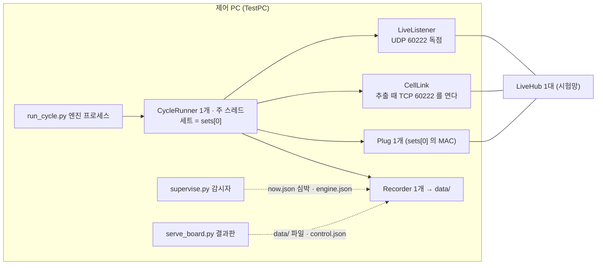
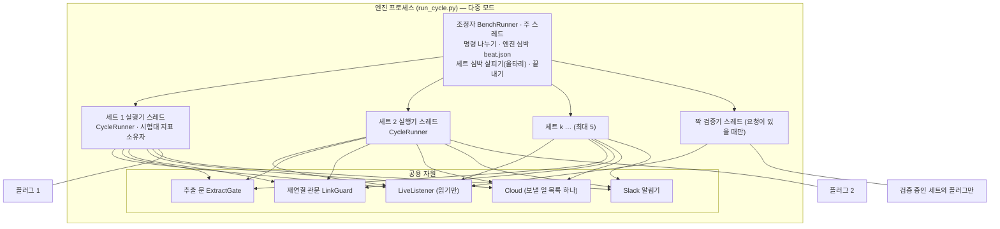
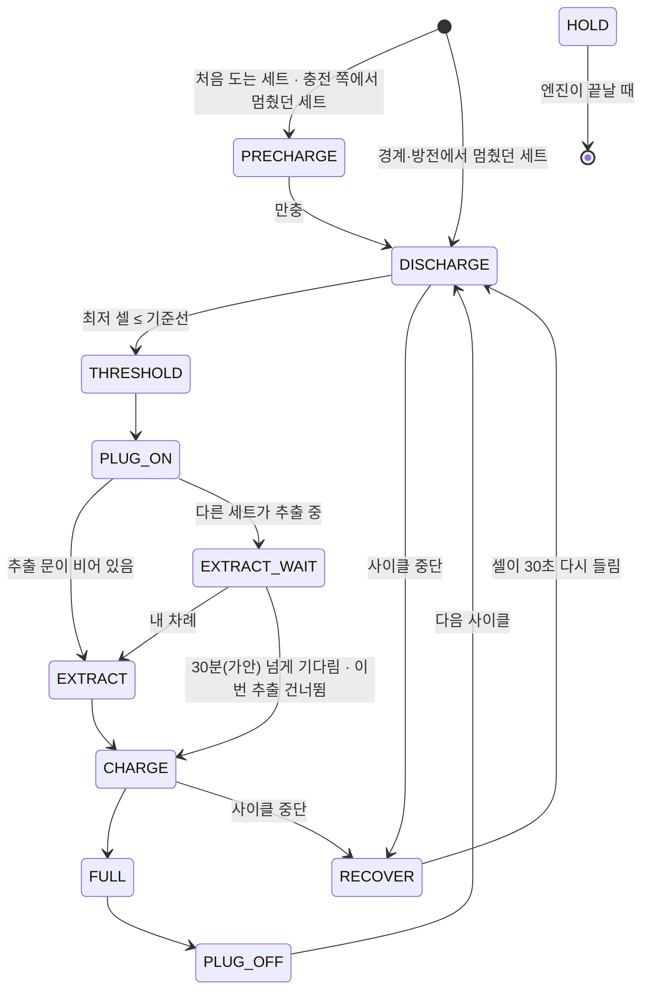
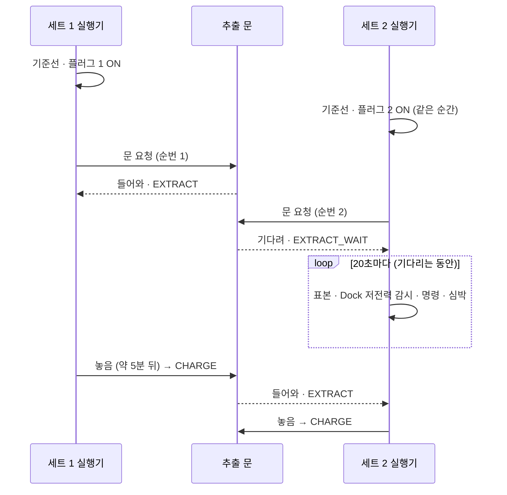
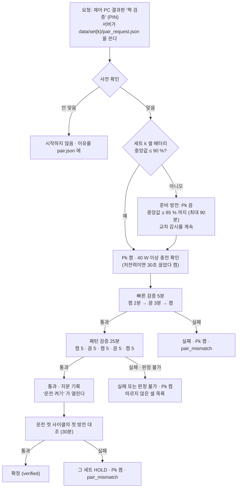

# 다중 세트 운전 — 설계 명세서 (초안 v1)

> **한 줄 요지:** 운전할 세트가 하나면 엔진은 지금 코드 경로를 그대로 타고(다르게 도는 곳은 7-1 의 세 줄뿐이며 세트 1 만 등록된 지금은 셋 다 아무 일도 하지 않는다), 둘 이상일 때만 새 조정자가 세트마다 지금의 사이클 실행기(CycleRunner)를 스레드로 돌린다. 세트 k(k ≥ 2)는 사람이 켠 운전 표지와 짝 검증 통과가 **둘 다** 있어야 돌고, 세트 하나의 고장은 그 세트만 플러그 ON 으로 멈춘다.

- 상태: **검토 전 초안.** 코드·설정·데이터베이스는 아직 하나도 바꾸지 않았다. 다음 단계에서 독립 검토자가 공격적으로 검증하고, 그 뒤에 8절 순서로 구현한다.
- 브랜치: `feat/multi-set-bench` (PR #5, Draft) · 작성 2026-10-11 · 기준 코드 = `main` 의 `85ffca5` (검사 512건 통과를 이 PC 에서 확인).
- 낱말: 세트 = 스마트 플러그 1 · Dock 1 · 셀 24. `sets[0]` = bench.json 의 세트 목록 첫 줄(지금 운전 중인 세트 1). 신호등 낱말은 정상 · 경고 · 조치 · 신호 없음.
- 숫자 옆의 **(가안)** 은 근거가 실측이 아니라 추정이라는 뜻이다. 가안 값은 8절 2단계의 보정 실측에서 정한다.

---

## 0. 핵심 결정 여섯 가지

1. **모드는 엔진이 시작할 때 정한다.** 운전할 세트가 하나면 지금과 같은 길(주 스레드의 `CycleRunner` 하나)로 돌고, 둘 이상이면 새 조정자 `BenchRunner` 가 세트마다 `CycleRunner` 를 스레드 하나씩으로 돌린다.
2. **등록만 된 세트는 절대 돌지 않는다.** 세트 k 는 bench.json 의 `"run": true`(사람이 PIN 으로 켬)와 `data/set{k}/pair.json` 의 짝 검증 통과(지금의 플러그 MAC·시리얼과 지문이 같을 것)가 둘 다 있을 때만 운전 목록에 들어간다.
3. **공용 자원은 셋만 잠근다.** 추출 문(TCP 60222 — 한 번에 한 세트, 먼저 온 순서), PC Wi-Fi 재연결(운전 중인 세트가 **모두** 안 들릴 때만), 클라우드 전송 목록(세트마다 간격을 따로 센다). 플러그는 세트마다 따로라 잠그지 않는다.
4. **고장은 세트 안에 가둔다.** 연속 실패 · 짝 불일치 · 멈춘 스레드는 그 세트만 `HOLD`(플러그 ON 으로 지키며 대기)로 보내고 다른 세트는 계속 돈다. 엔진 프로세스 자체가 죽으면 지금처럼 감시자가 엔진이 쥔 **모든** 플러그를 켜고 엔진을 다시 띄운다.
5. **세트 1 의 파일은 `data/` 그대로, 세트 k 는 `data/set{k}/` 에 같은 이름으로 둔다.** 클라우드는 모든 표에 `set_id`(기본 1)를 더하는 마이그레이션 초안을 둔다(적용하지 않는다). 엔진은 시작 때 스키마 판을 물어 요청 모양을 고르므로, 마이그레이션 전에는 요청까지 지금과 같다.
6. **세트 구성을 바꾸려면 엔진을 다시 시작한다.** 엔진이 세트 1 의 사이클 경계(만충 뒤 플러그 OFF 직후)에서 스스로 끝내고(`exit=reconfigure`), 감시자가 예비 충전 없이 곧바로 다시 띄운다. 세트 1 은 잃는 것이 없다 — 지금 쓰는 `tools/restart_at_boundary.ps1` 과 같은 경계다(그 스크립트도 `--precharge` 없이 띄운다, `restart_at_boundary.ps1:26`).

---

## 1. 지금 구조 — 단일 세트 가정이 박힌 곳

지금 엔진은 프로세스 하나에 실행기 하나다. 셀 라이브 포트(UDP 60222)를 독점으로 열기 때문에(`cells.py:61-78`) 같은 PC 에 엔진을 두 개 띄울 수 없다. 그래서 다중 세트는 **엔진 하나 안에서** 풀어야 한다.



아래 표가 "세트 하나"를 전제로 짜인 자리 전부다. 다중 세트에서 고칠 곳이 곧 이 목록이다.

| # | 자리 (파일:행) | 지금의 가정 | 다중에서 바뀌는 것 |
|---|---|---|---|
| 1 | `run_cycle.py:62` | Recorder 하나가 `data/` 에 쓴다 | 세트마다 Recorder (세트 1 = `data/`, 세트 k = `data/set{k}/`) |
| 2 | `run_cycle.py:92` | Plug 하나 = `cfg.plug_mac` = sets[0] | 세트마다 Plug |
| 3 | `run_cycle.py:101-103` | CellLink 하나, CycleRunner 하나를 주 스레드에서 | 세트마다 CycleRunner 스레드 + 공용 추출 문 |
| 4 | `run_cycle.py:78`, `140-153` | 비정상 종료 때 `plugs[0]` 하나만 켠다 | 엔진이 쥔 모든 플러그(운전 + 검증 중) |
| 5 | `run_cycle.py:130-137` | 목표 사이클 하나 (`data/cycles.csv` 줄 수 기준) | 세트별 목표 |
| 6 | `config.py:110-111`, `119-120`, `143`, `257-263` | `serials`·`plug_mac` = sets[0] | 세트마다 설정 보기 `set_cfg(s)` |
| 7 | `cycle.py:105-107`, `264-296` | 실행기가 명령 통로(control.json · 클라우드 표)를 직접 집고, 시작 때 남은 명령을 버린다 | 조정자가 모든 통로를 집어 세트별 대기열로 나눈다 |
| 8 | `cycle.py:305-307`, `845-852` | 안전 정지 = `run()` 전체가 끝남 | 세트 지정 없음 = 전체, 지정 = 그 세트만 |
| 9 | `cycle.py:339-344`, `737-741` | 셀이 하나도 안 들리면 PC Wi-Fi 를 다시 붙인다 | 운전 중인 세트가 모두 안 들릴 때만 |
| 10 | `cycle.py:493`, `642` · `cells.py:403-405` | 추출·대기 셀 깨우기가 TCP 60222 를 혼자 연다 | 공용 추출 문으로 한 번에 한 세트 |
| 11 | `cycle.py:142-154` · `record.py:211-225` | now.json 하나 = 시험대 상태이자 감시자의 심박 | 세트마다 now.json, 다중이면 엔진 심박은 `data/beat.json` |
| 12 | `cycle.py:173-200` | metrics 에 세트 지표와 시험대 지표(주소 변경 · 재연결 · 디스크 · 클라우드)가 섞여 있다 | 시험대 지표는 세트 1 실행기(소유자)만 |
| 13 | `cycle.py:573-590` | 디스크 감시 | 소유자 하나만 |
| 14 | `cycle.py:840-843` | 연속 실패 = 엔진 전체 끝(failsafe) | 그 세트만 HOLD |
| 15 | `record.py:181`, `207-209` | 알림 글에 세트가 없다 | 다중이면 '세트 k' 를 붙인다 |
| 16 | `cloud.py:155`, `190`, `202`, `290-323`, `304-306` | 행에 세트가 없다 · `on_conflict=bench_id…` · 표본 1분 간격과 '최신만 보내기'가 종류 하나로 센다 | (종류, 세트)로 센다 · set_id |
| 17 | `health.py:682-683`, `690-696`, `753-765` (특히 `756`) | 세트 차선(플러그 · Dock·셀 · 셀 수신 · 사람 조작)을 now.json 하나로 잰다 · 두 번째 세트부터는 '대기' | 세트마다 잰다 |
| 18 | `supervisor.py:405-407`, `511-518`, `549-555`, `609-613` · `supervise.py:144-155` | engine.json · now.json · cycles.csv 하나 · 플러그 ON 과 지키기가 `Plug(cfg)` = sets[0] | 엔진이 쥔 세트마다 |
| 19 | `serve_board.py:171`, `224-266`, `267-270`, `408-421` | `/api/*` 가 `data/` 하나 · 명령에 세트가 없다 · `running = i == 0` | `?set=k` · 명령에 세트 |
| 20 | `register.py:130-133`, `152-153`, `381-382` | 운전 중 = sets[0] | 운전 목록(engine.json) |
| 21 | `board/index.html:794-796`, `819-831`, `900-914`, `1137-1142`, `1233-1288`, `2018` | `runId` 하나 · 상태 `S.now` 하나 · 명령에 세트 없음 · 클라우드 질의에 set_id 없음 | 6절 |
| 22 | `20261008084739_bench_schema.sql:13`, `30`, `38`, `46` · `20261008120742_sample_buckets.sql:21` · `20261009235950_heartbeat_watch.sql:87` | 기본키 · 묶음 · 클라우드 심박이 시험대 단위 | 5절 마이그레이션 |

---

## 2. 목표 구조

### 2-1. 모드 판정 — 시작할 때 한 번

엔진은 시작할 때 운전 목록을 정한다.

```
운전 목록 = [sets[0]] + [세트 k | k ≥ 2, run = true, 짝 검증 통과(지문 일치), 클라우드 준비됨]
운전 목록이 하나 → 단일 모드 (지금 길 그대로)
운전 목록이 둘 이상 → 다중 모드 (BenchRunner)
```

- `sets[0]` 은 지금처럼 언제나 돈다. 이 세트의 짝은 운전 기록이 증명한다고 본다 — 엔진이 그 플러그를 끈 뒤 바로 그 셀들이 기준선까지 내려가 방전이 끝났다면(사이클 1 · 2) 플러그와 셀이 한 Dock 이라는 뜻이다. 이 PC 에는 TestPC 의 기록이 없어 확인은 9-2 ⑥ 으로 남긴다. 그래서 짝 검증을 면제한다(결정 필요 ⑥).
- `run` 이 켜졌는데 다른 조건이 모자라면 그 세트를 돌리지 않고 이유를 run.log 와 이상(경고 `set_not_ready`)으로 한 번 남긴다. 다른 세트는 영향받지 않는다.
- "클라우드 준비됨" = 클라우드가 꺼져 있거나, 켜져 있고 스키마 판이 2 이상(5-2). 원격 감시(FMEA P3) 없이 무인 세트를 늘리지 않으려는 관문이다.

### 2-2. 다중 모드의 프로세스와 스레드



조정자가 하는 일은 다섯이다. 첫째, 모든 명령 통로(로컬 control.json 들과 클라우드 표)를 20초마다 집어 세트별 대기열에 넣는다. 둘째, 20초마다 `data/beat.json` 에 엔진 심박과 세트별 심박을 쓴다. 셋째, 세트 심박이 멈춘 세트에 울타리를 친다(4절). 넷째, 짝 검증 요청 파일을 보고 검증기를 띄운다(3절). 다섯째, 세트 1 의 사이클 경계마다 운전 목록이 바뀌었는지 보아 바뀌었으면 엔진을 끝내고(2-8), 모든 세트가 끝나도 엔진을 끝낸다. 사이클 판정은 하나도 하지 않는다 — 그것은 지금처럼 `CycleRunner` 의 일이다.

### 2-3. 세트별 상태기계

지금의 단계(`cycle.py:28`)에 다중 모드에서만 쓰는 둘을 더한다: `EXTRACT_WAIT`(추출 대기)와 `HOLD`(세트 정지 — 플러그 ON 으로 지킴). 둘 다 플러그가 켜져 있어야 하는 단계라 `guards.PLUG_EXPECT`(`guards.py:26-27`)에 `True` 로 더한다.



어느 단계에서든 아래 다섯이면 곧장 `HOLD` 로 간다: 연속 실패 5번째(지금은 이때 엔진 전체가 끝난다 — `cycle.py:840-843`) · 세트 지정 안전 정지 · 짝 불일치(3절) · 스레드 예외 · 목표 사이클 도달(이때는 단계 이름을 `DONE` 으로 쓴다). `HOLD` 는 지금의 복구 대기(`cycle.py:712-757`)에서 "셀이 돌아오면 끝낸다"를 뺀 고리다 — 플러그를 켜 두고, 저전력이면 끊었다 켜고(PowerWatch), now.json 을 쓰고, 그 세트의 명령을 받는다. 세트 1 이 HOLD 여도 시험대 지표(디스크 등)는 이 고리에서 계속 잰다.

운전 세트가 모두 HOLD 나 DONE 이 되면 엔진은 끝난다. 끝난 이유(`engine.json` 의 `exit`)는 가장 무거운 것으로 적는다 — 연속 실패 · 짝 불일치 · 스레드 예외 · 울타리가 하나라도 있으면 `failsafe`(감시자가 되살리지 않고 사람을 부른다, `supervisor.py:258-260`), 아니면 세트 지정 정지가 하나라도 있으면 `stopped`, 모두 목표에 닿았으면 `done`. 셋 다 지금처럼 플러그를 켜 두고 끝내며, 그 뒤 플러그는 감시자의 플러그 지키기가 세트마다 본다.

처음 도는 세트와 다시 뜬 엔진의 시작 단계는 그 세트의 마지막 now.json 단계로 정한다. 기록이 없거나 충전 쪽(PRECHARGE · PLUG_ON · EXTRACT · EXTRACT_WAIT · CHARGE · FULL · RECOVER · HOLD)이면 예비 충전부터, 방전 쪽(DISCHARGE · THRESHOLD · PLUG_OFF)이면 방전부터다. 감시자가 `--precharge` 로 띄웠으면 모든 세트가 예비 충전부터다(지금 세트 1 과 같은 뜻). 단일 모드는 지금 규칙(`--precharge` 가 있을 때만 예비 충전) 그대로다.

### 2-4. 공용 자원과 잠금

| 자원 | 누가 쓰나 | 규칙 | 근거 |
|---|---|---|---|
| LiveListener (UDP 60222) | 모든 실행기 · 짝 검증기 | 프로세스에 하나, 스냅숏으로 읽기만 한다. 지금도 내부 잠금이 있다 | `cells.py:61-78`, `137-139` |
| 추출 문 `ExtractGate` (TCP 60222 · LiveHub 대역) | 추출 · 대기 셀 깨우기(resume) · 상태 묻기 | 한 번에 한 세트. 먼저 요청한 세트부터, 같은 순간이면 sets 순서. 추출은 기다리고(EXTRACT_WAIT), 깨우기는 기다리지 않는다(문이 차 있으면 다음 표본에 다시) | 추출 묶음마다 `(pc_ip, 60222)` 에 `SO_REUSEADDR` 로 연다(`cells.py:403-405`). 두 세트가 동시에 열면 어느 소켓이 셀 접속을 받을지 정해져 있지 않고, 묶음 밖 주소의 접속은 0x26 으로 돌려보내져(`cells.py:417-422`) 양쪽 추출이 다 깨진다. 대역은 6대 동시가 가장 효율이라는 실측(README 실측값)도 직렬을 뒷받침한다 |
| 재연결 관문 `LinkGuard` (PC Wi-Fi) | `_watch_link` · `_recover` | 운전 중(HOLD 아님)인 세트가 **모두** 60초 넘게 안 들릴 때만, 2분 간격을 모든 세트가 함께 센다 | 재연결은 PC 전체를 잠깐 끊는다(`cycle.py:342`). 세트 하나의 Dock 이 꺼졌다고 다른 세트의 추출·라이브를 끊으면 안 된다 |
| 명령 통로 | 조정자 하나 | 조정자가 집어 나눈다. 실행기는 자기 대기열만 본다 | 실행기마다 클라우드 표를 집으면 남의 세트 명령을 집는다(`cloud.py:326-339` 는 시험대 전체에서 가장 오래된 것 하나) |
| Cloud | 모든 Recorder | 하나를 함께 쓴다(보낼 일 목록 · 작업 스레드 하나). 표본 간격과 '최신만'을 (종류, 세트)로 센다 | 지금은 종류 하나로 센다(`cloud.py:155`, `202`, `304-306`) — 그대로 두면 세트 2 의 상태가 세트 1 의 상태를 '더 새것'으로 밀어내 버리고, 세트 2 표본이 세트 1 표본의 1분 간격에 걸려 버려진다 |
| Slack 알림기 | 모든 Recorder | 하나. 글에 '세트 k' 가 붙어 30초 중복 걸러내기가 세트를 섞지 않는다 | `alert.py` make_notifier |
| 디스크 · 클라우드 지표 | 세트 1 실행기(소유자) | 다중에서도 세트 1 실행기만 잰다. HOLD 고리에서도 계속 | `cycle.py:573-590` |
| `data/events.csv` · `data/run.log` | 세트 1 실행기 · 조정자(시험대 전체 이상) | Recorder 의 파일 쓰기 하나에 잠금 하나 | `record.py:142-153` 은 줄마다 파일을 열어 붙인다 |
| 플러그 | 세트마다 자기 것 | 잠그지 않는다 | 한 플러그 호출은 최대 약 66초(3 × (20 + 2), `plug.py:87-109`). 잠그면 한 세트의 무응답이 모든 세트의 '켜기'를 막는다 |

**교착을 막는 세 규칙.** 첫째, 잠금은 겹쳐 쥐지 않는다(위 잠금은 전부 잎 잠금이다). 둘째, 플러그·네트워크 호출은 잠금을 쥔 채로 하지 않는다(추출 문은 예외 — 문 자체가 네트워크 일을 직렬로 하려는 것이다). 셋째, 모든 기다림에는 한도가 있다(추출 대기 30분(가안), 스레드 합류 2분, 울타리 판정 300초).

### 2-5. 왜 스레드인가 — 한 고리 틱 방식과 비교

| 기준 | 세트마다 스레드 (채택) | 한 고리에서 세트를 번갈아 틱 |
|---|---|---|
| 지금 코드 재사용 | `CycleRunner` 를 거의 그대로 쓴다. 블로킹 고리 · `time.sleep` · 5분 추출이 그 스레드 안에서만 막힌다 | 단계 함수 전부(예비 충전 · 방전 · 추출 · 충전 · 복구 · 안전 끝내기)를 '한 틱' 단위로 다시 써야 한다 |
| 세트 1 동일성 | 단일 모드는 지금 길을 손대지 않는다 | 단일도 새 고리로 돌거나, 구현 두 벌을 유지해야 한다 |
| 고장 격리 | 플러그 66초 무응답 · 추출 5분이 그 세트만 막는다 | 한 세트의 블로킹 호출이 모든 세트의 표본 · 안전망을 막는다 |
| 공용 자원 | 잠금이 필요하다(2-4) | 저절로 직렬이다 |
| 위험 | 경쟁 상태 · 교착 → 잠금 셋으로 좁히고 2-4 규칙으로 막는다 | 큰 재작성 → 지금 시험 중인 세트 1 의 회귀 위험 |

스레드 방식에서 바꿔야 하는 작은 것: 실행기의 `time.sleep(poll_s)` 를 끊을 수 있는 기다림(`Event.wait`)으로 바꿀 수 있게 한다 — Ctrl+C 는 주 스레드에만 오기 때문이다. 단일 모드에서는 지금처럼 `time.sleep` 이다.

### 2-6. 우선순위와 추출 직렬화 — 두 세트가 동시에 기준선에 닿으면

플러그 켜기는 줄을 세우지 않는다. 기준선에 닿은 세트는 **곧바로** 자기 플러그를 켜 충전을 시작한다 — 충전 쪽이 안전하고, 추출은 원래 충전 중에 한다. 줄을 서는 것은 추출뿐이다.



- 기다리는 세트는 표본·안전망·명령을 계속 돈다. 그래서 추출을 기다리는 동안 Dock 이 1.5 W 로 멈춰도 저전력 복구가 잡는다. 기다린 시간도 충전 시간이다(충전 한도와 cycles.csv 의 충전 분은 플러그를 켠 시각부터 센다 — `cycle.py:674`, `706`).
- 최악의 기다림은 다른 네 세트의 추출(약 5분 × 4 = 20분)이다. 한도 30분(가안)을 넘으면 이번 사이클 추출을 건너뛰고(`extract_skipped`, 경고) 충전으로 간다. 셀 저장은 시간당 3.45 MB 라 한 사이클(약 21 MB)을 건너뛰어도 상한 160 MB 까지 여유가 있다(`config.py:133-134`) — 다음 사이클에 받는다.
- 방전 중 대기 셀 깨우기(`cycle.py:474-498`)는 문이 차 있으면 기다리지 않고 다음 표본에 다시 해 본다. 그때는 '마지막으로 깨운 시각'을 적지 않아 10분 간격 규칙에 걸리지 않는다.

### 2-7. 원격 명령의 길

| 명령 | 세트 지정 | 단일 모드 | 다중 모드 |
|---|---|---|---|
| 플러그 켜기 · 끄기 | 없음 | 지금처럼 그 세트 | **버린다** — 응답 "세트를 지정하지 않음", 이상 `manual_rejected`(경고) |
| 〃 | 세트 k | k 가 자기 세트면 실행, 아니면 버린다 | 세트 k 의 대기열. 운전 중이 아니면 버린다 |
| 안전 정지 | 없음 | 지금처럼 엔진 전체 정지 | **전체 정지** — 모든 세트 플러그 ON, `exit=stopped` |
| 〃 | 세트 k | 운전 세트가 하나면 전체 정지와 같다 | 세트 k 만 HOLD, 다른 세트는 계속 |

- 만료 규칙(엔진 시작 전에 보낸 명령은 버리고, 시작 뒤 명령은 15분 한도 안에서 실행 — `control.py:128-141`)은 그대로이며 조정자가 본다.
- 단일 모드에 들어가는 명령 변경은 **하나뿐**이다: "세트가 지정됐는데 자기 세트가 아니면 실행하지 않고 버린다." 지정이 없는 명령(옛 결과판 · 옛 클라우드 행)은 지금과 똑같이 처리된다. 이것이 없으면 새 결과판이 세트 2 로 보낸 '플러그 끄기'를 옛 엔진(또는 단일 모드 엔진)이 세트 1 에서 실행한다 — 다른 세트의 전원을 끊는 바로 그 사고다(FMEA 8.5).
- 서버(`POST /api/control`)는 운전 중이 아닌 세트로 가는 명령을 쓰기 전에 거부한다(운전 목록은 engine.json 의 `sets`, 없으면 `[sets[0]]`). 세트 1 과 지정 없는 명령은 지금처럼 `data/control.json`, 세트 k 는 `data/set{k}/control.json` 에 쓴다 — 두 사람이 20초 안에 서로 다른 세트로 보내도 한 파일을 덮어쓰지 않게(`control.py:80-85` 는 파일 하나를 덮어쓴다).
- PIN 과 잠금은 지금처럼 서버 전체에 하나다.

### 2-8. 세트 구성 바꾸기 — 경계에서 다시 시작


- 엔진은 사이클이 끝날 때마다(세트 1 의 `PLUG_OFF` 뒤) bench.json 을 다시 읽어 '바라는 운전 목록'을 계산한다. 지금과 같으면 아무 일도 없다 — 세트 1 만 등록된 지금은 언제나 같다.
- 다중에서 다시 시작하면 세트 1 이 아닌 세트는 사이클 중간일 수 있다. 그 세트는 2-3 의 시작 단계 규칙대로 이어 가고, 끊긴 사이클은 `note=reconfigure` 로 한 줄 남는다(사이클 하나만큼의 손실). 감시자는 다시 띄우기 전에 엔진이 쥐었던 모든 플러그를 켠다 — 새 엔진이 시작에 실패해도 셀이 방전된 채 남지 않게.
- 운전 끄기(`run = false`)는 다시 시작을 기다리지 않는다. 그 세트는 다음 표본에서 곧바로 HOLD 로 가고, 다음 다시 시작 때 운전 목록에서 빠진다.
- 대안(운전 중에 세트를 끼워 넣기)은 결정 필요 ③ 에 둔다.

---

## 3. 짝 검증

### 3-1. 무엇을 막나

짝이 틀리면(bench.json 은 세트 k = 플러그 Pk · 셀 Ck 인데, 실제로는 Pk 가 세트 j 의 Dock 을 먹인다) 셀이 죽는 길이 생긴다.

1. 세트 k 가 방전을 시작하며 Pk 를 끈다. 실제로는 세트 j 의 Dock 전원이 끊긴다.
2. 세트 k 의 셀은 계속 충전되므로 기준선에 닿지 않고, 세트 j 의 셀은 충전 단계인데도 내려간다.
3. 세트 j 는 만충 판정이 안 나 충전 한도(4시간)로 넘어가고, 그사이 j 의 셀은 기준선 아래로 내려간다. 다음 단계에서 j 가 Pj 를 켜도 그것은 세트 k 의 Dock 이다 — j 의 셀은 0 % 까지 간다.

그래서 검증의 핵심 질문은 하나다: **"Pk 를 끄고 켤 때, Ck 만 따라 움직이고 다른 셀은 움직이지 않는가."** 셀이 다른 Dock 에 꽂혔거나 시리얼을 잘못 넣은 '셀 단위' 틀림도 같은 질문으로 잡는다.

### 3-2. 절차

검증기는 **엔진 안**에서 돈다. 셀 라이브 포트(UDP 60222)를 엔진이 독점으로 쥐고 있어서(`cells.py:61-78`), 엔진이 도는 동안 다른 프로세스는 셀 배터리를 들을 수 없기 때문이다(등록 화면이 엔진의 now.json 을 빌려 쓰는 것과 같은 이유 — `register.py:328-335`). 엔진이 없을 때만 `tools/pair_check.py --set k` 가 같은 검증기를 자기 LiveListener 로 돌린다(엔진이 돌면 PortBusy 로 거부).



사전 확인 다섯 가지 — 하나라도 안 맞으면 시작하지 않는다.

1. 세트 k 가 등록돼 있고 운전 목록에 없다.
2. 세트 k 의 셀 24대가 모두 15초 안에 들리고 대기 모드가 아니다.
3. Pk 를 읽을 수 있다(재시도 없이 8초 — `register_plug_timeout_s`, `config.py:221`).
4. 다른 검증이 돌고 있지 않다(검증기는 한 번에 하나).
5. 운전 중인 어느 세트도 지금 HOLD 나 RECOVER 가 아니다 — 사람이 봐야 할 일이 있는 동안 새 변수를 더하지 않는다.

### 3-3. 판정식

**표기.** b_c(t) 는 셀 c 가 라이브로 보낸 배터리(정수 %)다. 검증기는 10초마다 들리는 모든 셀의 값을 적는다(`LiveListener.snapshot`). s_c(W) 는 구간 W 동안 b_c 의 최소제곱 기울기(%/분)다. 무리는 셋으로 나눈다 — Gk(세트 k 의 셀 24), 운전 중인 세트 j 마다 Gj, 그리고 Gx(그 밖에 들리는 셀: 미등록 · 운전하지 않는 다른 등록 세트).

**기대 크기의 근거.** 충전 30 → 100 % 가 199분(사이클 1) · 148분(사이클 2)이었으니 +0.35 ~ +0.47 %/분이고, 방전 100 → 30 % 가 약 3.4시간이니 −0.34 %/분이다. 그래서 짝이 맞는 셀은 플러그를 켰을 때와 껐을 때 기울기가 약 0.7 %/분 달라지고, 짝이 아닌 셀은 0 근처다. 아래 문턱은 모두 **(가안)** 이다.

| 검증 | 재는 것 | 통과 (모두 만족) | 실패의 뜻 |
|---|---|---|---|
| 빠른 (5분) | r_c = s_c(켬 2분) − s_c(끔 3분) | ① Gk 의 r 중앙값 ≥ 0.30 ② Gk 중 r ≥ 0.15 인 셀이 20대 이상 ③ 다른 무리마다 r 중앙값 < 0.10 | ③ 이 깨지면 "Pk 가 다른 무리의 Dock 을 먹인다" — 그 자리에서 Pk 를 켜고 끝낸다. ① 이나 ② 가 깨지면 "Pk 가 세트 k 의 Dock 을 먹이지 않는다" |
| 패턴 (25분) | 구간 w(5분씩 다섯)마다 기울기 s_c,w 와 플러그 상태 p_w(켬 1 · 끔 0)의 상관 ρ_c | ① Gk 의 모든 셀 ρ ≥ 0.8 ② Gk 밖의 들리는 모든 셀 ρ < 0.5 | ① 을 못 넘은 셀은 다른 Dock 에 꽂혔거나 시리얼이 틀렸다. ② 를 넘은 셀은 이 Dock 에 꽂혔는데 다른 세트나 미등록으로 적혔다 |
| 첫 방전 대조 (운전 첫 사이클, 30분) | 방전 시작(Pk 끔) t0 부터의 하락 d_c(t) = b_c(t0) − b_c(t) | 30분 안에 Gk 의 d 중앙값 ≥ 3 %p (닿는 순간 통과) | 30분에 미달이면 실패. 그 전이라도, 충전 쪽 단계이고 플러그가 40 W 이상인 운전 세트 j 에서 Gj 의 d 중앙값 ≥ 2 %p 이면 **즉시** 실패 — Pk 가 j 의 Dock 을 먹인다는 증거 |
| 방전 반응 대조 (다중 모드의 매 사이클) | 첫 방전 대조와 같다 | 같다 | 사이클 사이에 누가 케이블을 바꿔 꽂았다 |
| 준비 방전 중 교차 감시 | 첫 방전 대조의 '즉시 실패'와 같다 | — | 즉시 Pk 를 켜고 끝낸다 |

- 셀 하나의 짧은 구간 기울기는 정수 % 때문에 흔들린다. 그래서 빠른 검증은 무리의 **중앙값**으로 "플러그 ↔ Dock" 만 보고, 셀 하나하나는 구간이 긴 패턴 검증이 본다.
- 95 % 이상인 셀은 충전 기울기가 0 에 가까워 패턴 판정에서 빼고 '판정 불가'로 적는다. 2대를 넘으면 검증 전체가 '판정 불가'로 끝난다(셀이 덜 찼을 때 다시).
- 첫 방전 대조가 기울기가 아니라 '30분 안 3 %p 하락'인 까닭: 첫 방전은 예비 충전 직후 100 % 에서 시작하는데, 배터리 표시가 100 % 에 몇 분 머물 수 있다(모름 — 9-2 ②). 30분 · 3 %p 는 그 머묾을 넉넉히 덮도록 잡았다.

### 3-4. 언제 필수인가

| 때 | 빠른 | 패턴 | 첫 방전 대조 | 방전 반응 대조 |
|---|---|---|---|---|
| 세트 k 를 처음 운전하기 전 | 필수 | 필수 | 첫 사이클에 자동 | — |
| 짝 지문이 바뀐 뒤 (해제 후 재등록 · 플러그 MAC · 시리얼) | 필수 | 필수 | 자동 | — |
| 짝 불일치로 HOLD 된 세트를 다시 켤 때 | 필수 | 필수 | 자동 | — |
| 다중 모드의 매 사이클 (세트 1 포함) | — | — | — | 자동 |
| 단일 모드 | 하지 않는다 — 세트 1 은 면제이고 지금과 같게 돈다 | | | |

**짝 지문** = 플러그 MAC(대문자)과 정렬한 시리얼 목록을 이은 글의 SHA-256 앞 16자. `pair.json` 에 지문 · 단계별 결과 · 시각 · 판정 수치(r · ρ · d)를 남긴다. 지문이 지금 bench.json 과 다르면 그 기록은 없는 것으로 본다. 서버의 '운전 켜기'와 엔진의 모드 판정이 둘 다 지문을 대조한다.

### 3-5. 실패 시 동작과 운전 중인 세트에 주는 영향

- 검증기는 **Pk 하나만** 만진다. 다른 세트의 플러그 · 추출 문 · 재연결 관문을 쓰지 않고, LiveListener 는 읽기만 한다.
- 어떤 길로 끝나든 Pk 를 켠 채로 끝낸다(30초 끊었다 켜고, 40 W 이상으로 Dock 이 충전을 다시 시작했는지 확인 — 지금의 `_safe_end` 와 같은 규칙, `cycle.py:860-908`). 사람이 '검증 멈춤'을 눌러도 같다.
- 엔진이 검증 중에 죽으면: 검증 중인 세트를 engine.json 의 `verifying` 에 적어 두므로, 비정상 종료 길(atexit, `run_cycle.py:140-153`)과 감시자의 플러그 ON 이 Pk 도 켠다.
- 실패하면 pair.json 에 '실패'와 이유(어느 셀이 따르지 않았나 · 어느 무리가 따랐나)를 남기고, 세트 k 의 기록에 이상 `pair_mismatch`(조치 · Slack)를 남긴다. 운전 중인 세트 j 가 따랐으면 글에 j 를 적는다.

| 경우 | 운전 중인 세트 j 가 겪는 일 | 크기 |
|---|---|---|
| 짝이 맞다 (Pk 가 Dock k) | 없다 — j 의 플러그 · 셀 · 추출에 닿지 않는다 | — |
| Pk 가 j 의 Dock 을 먹이고 j 가 충전 중 | 검증의 '끔' 동안 j 의 Dock 이 꺼진다 | 빠른 검증에서 3분이고 그 자리에서 실패한다. 준비 방전이라면 교차 감시가 2 %p 하락(0.34 %/분이면 약 6분)에서 끊는다. j 의 셀은 몇 %p 덜 차고 만충이 그만큼 늦는다. 셀이 0 % 로 가는 길은 없다 |
| Pk 가 j 의 Dock 을 먹이고 j 가 방전 중 | 검증의 '켬' 동안 j 의 Dock 이 켜져 j 의 방전이 늦어진다 | 검증 시간만큼. 실패 뒤에도 Pk 를 켠 채 두므로(안전 쪽) j 의 이번 사이클 방전 기록은 흐려진다 — 이상 글에 j 를 적어 사람이 그 사이클을 걸러 보게 한다 |
| j 가 만충(100 %) | 표시가 100 % 에 머물러 교차 감시가 못 볼 수 있다 | 9-2 ② 로 확인한다. 못 보더라도 j 는 '덜 찬 채 다음 방전'이 될 뿐이다 |

---

## 4. 고장 모드 — 세트 범위로 갇히나

| 고장 | 누가 알아채나 | 무엇을 하나 | 범위 | 단일 모드와의 차이 |
|---|---|---|---|---|
| 세트 k 플러그 무응답 | 그 실행기의 Plug (3번 재시도 → 이상 `plug`, 경고) | 그 실행기만 다음 표본에서 다시 한다. 충전 쪽이면 PowerWatch 가 켜기를 되풀이한다(`cycle.py:383-426`) | 세트 k | 같다. 잠금이 없어 다른 세트를 늦추지 않는다 |
| 세트 k 셀 전부 끊김 (Dock 꺼짐 · 셀 꺼짐) | 그 실행기의 `_watch_link` | 60초 뒤 PC Wi-Fi 재연결은 **운전 세트가 모두 안 들릴 때만**. 5분 뒤 사이클 중단 → 그 세트만 RECOVER(플러그 켬, 30분 뒤 사람 호출) | 세트 k | 단일에서는 '그 세트 = 모든 세트'라 같다 |
| Dock 충전 멈춤 (켜짐 · 1.5 W) | 그 실행기의 PowerWatch | 그 세트 플러그만 30초 끊었다 켠다(단계마다 3번, 다 쓰면 `dock_power`) | 세트 k | 같다 |
| 세트 k 연속 실패 5번째 | 그 실행기의 감독 고리 | 지금은 엔진 전체가 끝난다(failsafe). 다중에서는 그 세트만 HOLD + `set_hold`(조치) | 세트 k | 단일은 지금 그대로 |
| 세트 k 스레드가 예외로 빠짐 | 스레드 감싸개 | 그 세트 플러그 켬 + HOLD + `set_hold` | 세트 k | 단일에는 없다 |
| 세트 k 스레드 멈춤 (교착 · 무한 대기) | 조정자 — 그 세트 심박이 300초(추출 중 1200초) 넘게 멈춤. 문턱은 감시자와 같다(`config.py:199-200`) | **울타리**: 조정자가 그 세트 플러그를 자기 Plug 로 켜고, 그 실행기의 '끄기'를 막는 표지를 세운다 + `set_hold`. 파이썬 스레드는 죽일 수 없어 그 세트는 엔진이 다시 뜰 때까지 HOLD | 세트 k | 단일은 지금처럼 감시자가 엔진 전체를 끝내고 되살린다 |
| 추출 문을 쥔 세트가 놓지 않음 | 기다리는 세트의 30분 한도 | 기다리던 세트는 이번 추출을 건너뛰고 충전으로 간다. 쥔 세트는 위 '스레드 멈춤'에 걸린다 | 기다린 세트는 한 사이클 추출 손실 | 단일에는 없다 |
| 엔진 프로세스 크래시 · 강제 종료 | atexit · 감시자 | 엔진이 쥔 모든 플러그(운전 + 검증 중)를 켠다 — 끄기를 다 한 뒤 30초를 한 번 기다리고 켜기를 다 한다. 감시자가 `--precharge` 로 다시 띄운다(모든 세트 예비 충전) | 전체 — 프로세스가 하나라 피할 수 없다 | 플러그가 여럿일 뿐 같은 길 |
| 조정자 멈춤 | 감시자 — beat.json 이 멈춤(다중에서는 now.json 대신 이것을 본다) | 엔진을 끝내고 위와 같다 | 전체 | 다중만 |
| LiveHub · PC Wi-Fi 끊김 | 모든 실행기가 안 들림 | 공용 재연결 하나(2분 간격). 5분 뒤 모든 세트 RECOVER | 전체 (공용 자원) | 같다 |
| 원격 명령이 엉뚱한 세트로 | 서버 · 조정자 | 다중에서는 세트 지정 없는 플러그 명령을 버린다. 운전 중이 아닌 세트로 가는 명령은 서버가 거부한다. 확인 팝업이 대상 세트를 크게 적는다 | 지정한 세트 | 단일은 '자기 세트가 아닌 지정 명령은 버림' 하나만 다르다 |
| 안전 정지 | 사람 | 지정 없음 = 전체(모든 플러그 켬 · `exit=stopped`), 세트 지정 = 그 세트만 HOLD | 사람이 고른 범위 | 단일은 같다 |
| 감시자 되살림 | 감시자 | engine.json 의 `sets` · `verifying` 의 플러그를 모두 켠 뒤 다시 띄운다. 남은 사이클은 세트별 목표로 센다(결정 필요 ④). 시간당 한도 3회는 엔진 전체에 하나 | 전체 | engine.json 에 다중 칸이 없으면 지금 판정 그대로 |
| 짝 불일치 (첫 방전 · 방전 반응 대조) | 그 실행기 | 그 세트 플러그 켬 + HOLD + `pair_mismatch`. 증거가 된 세트 j 의 이름을 함께 알린다. j 는 계속 돈다 | 세트 k | 단일에서는 대조하지 않는다 |
| 디스크 · 클라우드 키 · Slack | 세트 1 실행기 · Cloud · 감시자 | 지금 그대로 | 전체 | 같다 |

---

## 5. 기록 · 클라우드

### 5-1. 로컬 파일 배치

| 무엇 | 세트 1 (`sets[0]`) | 세트 k (k ≥ 2) |
|---|---|---|
| `cycles.csv` · `events.csv` · `samples_NNNN.csv` · `cells_NNNN.csv` · `discharge_NNNN.csv` · `ftg/NNNN/` · `now.json` · `plug_stats.json` · `control.json` · `control_ack.json` · `run.log` | `data/` — **지금 그대로** | `data/set{k}/` — 같은 이름 |
| `pair.json` · `pair_request.json` · `pair.log` | 없다 (면제) | `data/set{k}/` |
| `engine.json` · `supervisor.json` · `supervisor.log` · `health.json` · `osinfo.json` · `plugs.json` · `alert_state.json` · `alert_ack.json` · `supervisor_pause` · `run_config.json` | `data/` — 시험대 전체 것, 지금 그대로 | — |
| `beat.json` (엔진 심박 + 세트별 심박) | 다중 모드에서만 `data/` 에 새로 생긴다 | — |

- 세트 1 을 `data/` 에 남기는 이유: 쌓인 사이클 기록 · 추출 파일을 옮기지 않아도 되고, 세트 1 만일 때 경로와 이름이 그대로다. 대가는 비대칭이다 — 세트 1 의 폴더에 시험대 전체 파일이 섞인다. 그래서 규칙을 "sets[0] = `data/`, 나머지 = `data/set{id}/`" 하나로 정하고, 코드에서는 `set_dir(cfg, set)` 한 곳에서만 계산한다. 세트 설정 보기 `set_cfg(cfg, s)` 가 `data_dir` 을 그 폴더로 바꾸므로, Recorder · 추출 폴더(`cycle.py:642`) · 플러그 통계(`run_cycle.py:92`) · 명령 파일(`cycle.py:105`)이 저절로 따라간다.
- 시험대 전체 이상(PC Wi-Fi 재연결 · 디스크 · 클라우드 전송 실패 · 세트 지정 없는 명령)은 지금처럼 `data/events.csv` 에 세트 1 의 사이클 · 단계 칸으로 남는다. 세트 1 만일 때 지금과 같은 줄이다.
- `engine.json` 은 단일 모드에서 지금과 같다. 다중 모드(또는 검증 중)에서만 `mode` · `sets`(운전 목록) · `set_targets`(세트별 마지막 사이클 번호) · `verifying` 이 붙는다.
- 다중 모드의 알림 글은 "[셀 시험대] {종류} · 세트 k · 사이클 …" 이다(`record.py:181` 에 세트 칸을 더함). 사이클 끝 요약(`record.py:207-209`)도 같다. 단일 모드는 지금 글 그대로다.

### 5-2. 클라우드 요청의 두 모양

Cloud 는 시작할 때 RPC `bench_schema_version()` 을 한 번 부른다.

| 탐침 결과 | 요청 모양 | 그때 |
|---|---|---|
| 함수 없음 (404) | **지금 그대로** — 본문에 set_id 없음, `on_conflict=bench_id` · `bench_id,t` · `bench_id,cycle` · `bench_id,cycle,serial` | 마이그레이션 전. 세트 1 만 돌 수 있다(2-1 '클라우드 준비됨') |
| 2 이상 | 본문에 `set_id`, on_conflict 에 set_id (예: `bench_id,set_id,t`) | 마이그레이션 뒤. 세트 1 도 이 모양이며, set_id = 1 은 칸의 기본값과 같아 행의 값은 그대로다 |

- 탐침의 실패는 전송 실패로 세지 않는다 — 신호등 '클라우드' 차선의 실패 수(`cloud.py:280-287`)가 지금과 같게.
- 운전 중에 마이그레이션을 적용하면 옛 모양의 upsert 는 "on_conflict 에 맞는 제약 없음"(Postgres 42P10, HTTP 400)으로 실패한다. 그 오류를 받으면 탐침을 다시 하고, 다시 보낼 때 요청 모양을 그 순간 정한다. 지금은 넣을 때 모양이 굳는다(`cloud.py:293` 등의 람다) — 이것을 '보낼 때 짓기'로 바꾼다. 그래서 몇 건이 30초 뒤 재시도로 들어갈 뿐 버려지는 것은 없다.
- 표본 간격(`cloud.py:304-306`)과 '최신만 보내기'(`cloud.py:155`, `190`, `202`)는 (종류, 세트)로 센다. 세트 번호가 없으면(단일 · 옛 모양) 지금과 같은 열쇠다.
- 보낼 일 목록 상한(500건, `cloud.py:34`)은 세트 수만큼 빨리 찬다. 표본부터 버리는 규칙은 그대로 두고 상한을 '500 × 운전 세트 수'로 한다(가안).
- 클라우드 결과판도 시작할 때 같은 RPC 를 부른다. 2 이상일 때만 질의에 `set_id=eq.k` 를 붙인다 — 마이그레이션 전에는 세트 1 의 행만 있으므로 거르지 않아도 맞다.

### 5-3. 마이그레이션 초안 SQL — 적용하지 않는다

대상은 Supabase 프로젝트 cell-bench(`rmlxafxegabeqqtuvyyb`) 하나뿐이고, 그것이 운영 환경이다(비운영 환경이 따로 없다). 그래서 적용 전에 로컬 Postgres 의 빈 DB 에 지금 파일 6개와 함께 처음부터 적용해 보는 검사를 8절 11단계에 둔다. 적용은 사람 승인 뒤 데이터베이스 쓰기 규칙의 열쇠 절차로 한다. 파일 이름은 구현 때 `date -u +%Y%m%d%H%M%S` 로 짓는다(`<시각>_bench_multi_set.sql`).

```sql
-- 다중 세트 — 모든 측정 표에 세트 칸을 더하고, 세트마다 행이 갈리도록 기본키를 바꾼다.
-- 기존 행은 모두 set_id = 1 (세트 1). 상수 기본값 칸 추가는 Postgres 11 이상에서 기존 행을 고쳐 쓰지 않는다.
begin;

-- 1) 세트 칸
alter table public.bench_state     add column if not exists set_id smallint not null default 1 check (set_id >= 1);
alter table public.bench_sample    add column if not exists set_id smallint not null default 1 check (set_id >= 1);
alter table public.bench_cycle     add column if not exists set_id smallint not null default 1 check (set_id >= 1);
alter table public.bench_discharge add column if not exists set_id smallint not null default 1 check (set_id >= 1);
alter table public.bench_event     add column if not exists set_id smallint not null default 1 check (set_id >= 1);
alter table public.bench_command   add column if not exists set_id smallint check (set_id >= 1);  -- null = 세트 지정 없음 (전체 정지 · 옛 결과판)

-- 2) 기본키 — 세트마다 '지금 상태' 한 줄, 같은 초의 표본 · 같은 번호의 사이클이 세트마다 따로
alter table public.bench_state     drop constraint bench_state_pkey,     add primary key (bench_id, set_id);
alter table public.bench_sample    drop constraint bench_sample_pkey,    add primary key (bench_id, set_id, t);
alter table public.bench_cycle     drop constraint bench_cycle_pkey,     add primary key (bench_id, set_id, cycle);
alter table public.bench_discharge drop constraint bench_discharge_pkey, add primary key (bench_id, set_id, cycle, serial);
create index if not exists bench_event_set_t on public.bench_event (bench_id, set_id, t desc);

-- 3) 표본 묶음 — 반환 칸이 바뀌어 create or replace 로는 안 된다. 뷰 → 함수 순으로 지우고 다시 만든다
drop view if exists public.bench_sample_10m;
drop view if exists public.bench_sample_1h;
drop function if exists public.bench_sample_bucket(int);
create function public.bench_sample_bucket(bucket_s int)
returns table (bench_id text, set_id smallint, t timestamptz, cycle int, phase text, plug_on boolean, watts numeric,
               wh numeric, batt_min int, batt_avg numeric, batt_max int, cells_alive int, n int)
language sql stable security invoker as $$
  select bench_id, set_id,
         to_timestamp(floor(extract(epoch from t) / bucket_s) * bucket_s),
         min(cycle), mode() within group (order by phase), bool_or(plug_on), round(avg(watts)::numeric, 2), max(wh),
         min(batt_min)::int, round(avg(batt_avg)::numeric, 1), max(batt_max)::int, min(cells_alive)::int, count(*)::int
  from public.bench_sample
  group by bench_id, set_id, 3
$$;
create view public.bench_sample_10m with (security_invoker = true) as select * from public.bench_sample_bucket(600);
create view public.bench_sample_1h  with (security_invoker = true) as select * from public.bench_sample_bucket(3600);
grant select on public.bench_sample_10m, public.bench_sample_1h to anon, authenticated;
grant execute on function public.bench_sample_bucket(int) to anon, authenticated;

-- 4) 클라우드 심박 (20261009235950 의 bench_heartbeat_check) — 세트마다 한 줄이 생기므로 시험대 단위로 묶어 본다.
--    바뀌는 것은 고리의 머리와 '일부러 끝남' 조건 둘이고, 나머지 본문은 그 파일 그대로다(구현 때 전문을 옮겨 고친다).
--      for r in
--        select b.bench_id, max(b.updated_at) as updated_at,
--               (array_agg(b.cycle order by b.set_id))[1] as cycle,
--               (array_agg(b.phase order by b.set_id))[1] as phase,
--               bool_and(coalesce(b.phase, '') in ('DONE', 'STOPPED'))
--                 filter (where b.updated_at >= b.last_at - interval '10 minutes') as ended
--          from (select s.*, max(s.updated_at) over (partition by s.bench_id) as last_at from public.bench_state s) b
--         group by b.bench_id
--      loop
--        … if r.updated_at < now() - stale and not coalesce(r.ended, false) then …
--    '10분 안에 갱신된 세트만' 보는 까닭: 운전 목록에서 빠진 세트의 옛 줄(단계가 CHARGE 등으로 멈춰 있음)이 엔진이 일부러
--    끝났을 때 '끝나지 않음'으로 남아 거짓 경보를 내지 않게. 지금 함수를 그대로 두면 세트 줄마다 판정해, 멈춘 옛 줄 하나가
--    1분마다 '소식 없음'과 '복구'를 번갈아 낸다(bench_watch 의 기본키가 bench_id 하나라서).

-- 5) 스키마 판 — 엔진의 탐침과 클라우드 결과판이 읽는다
create or replace function public.bench_schema_version() returns int language sql immutable as $$ select 2 $$;
grant execute on function public.bench_schema_version() to anon, authenticated, service_role;

commit;
notify pgrst, 'reload schema';
```

**기본키 · 뷰 · RLS 영향.**

- 읽기 정책은 모두 `using (true)`, bench_command 의 넣기 정책은 `with check (requested_by = auth.email())` 라 행 단위 조건이 없다(`20261008084739_bench_schema.sql`, `20261008111235_public_read.sql`). 새 칸은 표의 RLS 를 그대로 따르므로 정책은 고치지 않는다.
- 로그인한 사용자는 bench_command 에 아무 set_id 나 넣을 수 있다. 엔진이 운전 중이 아닌 세트의 명령을 버리므로(2-7) 정책으로 막지 않는다. 막고 싶으면 `check (set_id between 1 and 5)` 를 더한다(가안).
- 묶음 뷰 둘은 `security_invoker` 그대로 다시 만든다. 심박 함수는 `security definer` · `search_path = ''` 그대로다.
- `bench_health` 와 `bench_watch` 는 시험대 단위로 둔다 — 신호등 판정은 시험대 하나에 한 줄이고, 세트별 불은 payload 의 `sets` 안에 있다.
- 기본키를 바꾸는 동안 표가 잠깐 잠긴다. bench_sample 은 30일 보관이면 약 4만 3천 행이라 짧다. TestPC 의 전송은 그동안 기다리거나 재시도한다.

**되돌리기.** 세트 2 이상의 행을 지워야 옛 기본키로 돌아갈 수 있고, 지운 행은 되살릴 수 없다. 순서: 각 표에서 `delete … where set_id <> 1` → 기본키를 원래대로(`bench_state (bench_id)` · `bench_sample (bench_id, t)` · `bench_cycle (bench_id, cycle)` · `bench_discharge (bench_id, cycle, serial)`) → 묶음 뷰 · 함수를 지우고 `20261008120742_sample_buckets.sql` 을 다시 적용 → 심박 함수는 `20261009235950_heartbeat_watch.sql` 을 다시 적용 → `drop function bench_schema_version()` → 마지막에 `drop column set_id`.

### 5-4. 적용 순서

| 순서 | 무엇 | 그때 세트 1 은 |
|---|---|---|
| 1 | 이 브랜치의 코드가 TestPC 에 들어간다 (사이클 경계 재시작) | 단일 모드 · 요청 모양도 지금 그대로 |
| 2 | PR 머지 → 클라우드 결과판 배포 (main 푸시마다 Vercel 이 `cell-bench/deploy/board` 를 올린다) | 결과판은 스키마 판 1 을 보고 거르지 않는다 |
| 3 | 사람 승인 → 마이그레이션 적용 | 다음 upsert 가 42P10 으로 실패 → 탐침 → 새 모양으로 재시도. 행 값은 같다 |
| 4 | 그 뒤에야 세트 2 의 '운전 켜기'가 열린다 | — |

---

## 6. 결과판 · 신호등 · 원격 명령 화면 변경 목록

| 자리 (`board/index.html`) | 세트 1 만 운전 (지금) | 둘 이상 운전 |
|---|---|---|
| 관제 · 시험실 맵 · 세트 카드 (`900-914`, `1137-1200`) | 그대로 | 운전 세트마다 '운전' 카드(지금 runCard 를 세트마다). HOLD 는 조치색 '정지 · 플러그 ON · 사유'. EXTRACT_WAIT 는 '추출 대기 · 세트 j 추출 중' |
| 세트 상세 (`1473-1500`) | 그대로 | 그 세트의 now · 표본 · 사이클 · 이상 · 셀을 `?set=k`(로컬) · `set_id=eq.k`(클라우드)로 읽는다 |
| 원격 명령 팝업 (`1233-1288`) | 그대로 | 확인 칸 첫 줄에 '대상: 세트 k' 를 크게. 안전 정지는 단추 둘 — '세트 k 정지'(그 세트만 HOLD) · '전체 정지' |
| 운전 대기 세트의 카드 · 머리말 (`1139-1142`, `1477`) | 문구만 바뀐다: '다중 세트 적용 뒤 운전' → '짝 검증 전' · '짝 검증 통과 · 운전 꺼짐' · '운전 켜짐 · 세트 1 경계에서 시작' | 같음 |
| 운전 대기 세트의 짝 화면 (`1424-1470`) | 세트 1 만 등록이면 보이지 않는다 | 새 카드 '짝 검증' — 단계 · 진행 · 수치(r · ρ · d) · 따르지 않은 셀. 단추 '짝 검증 시작' · '멈춤' · '운전 켜기 / 끄기'(모두 PIN, 제어 PC 만) |
| 등록 화면 문구 (`register.py:38-39`, `index.html:2149`, `2166`) | '운전은 다중 세트 기능 적용 뒤' → '짝 검증을 통과하고 운전을 켜면 세트 1 경계에서 시작' | 같음 |
| 최근 활동 (`1191-1203`) | 그대로 | 세트마다 사이클 · 이상을 모아 세트 이름을 붙인다 |
| 점검 · 신호등 9차선 (`1937-1990`) | 그대로 | 세트 차선 카드에 세트별 줄, 이유 앞에 '세트 k · ' |
| 클라우드 결과판 (`819-831`) | 그대로 | 스키마 판 2 이상일 때 질의에 `set_id=eq.k`. 명령에 `set_id`. 짝 검증 · 운전 켜기는 "제어 PC 결과판에서" 안내만 |

**신호등 (`cellbench/health.py`).**

- 세트 차선(플러그 · Dock·셀 · 셀 수신 · 사람 조작)은 운전 세트마다 그 세트의 now.json 으로 따로 잰다. 9차선에 보이는 세트 차선의 불은 세트 중 가장 나쁜 것이고, 문제(issues)는 세트별로 이어 붙인다. 다중 모드에서는 이유 글 앞에 '세트 k · ' 를 붙인다 — 알림기는 이유가 바뀌면 새 사건으로 보내므로(`health.py` 모듈 설명의 약속 1), 세트 2 의 새 문제가 세트 1 의 같은 문제에 묻히지 않는다.
- 시험대 차선(전원·OS · 프로그램 · 무선 · 기록·디스크 · 클라우드)은 지금처럼 하나다. 다중 모드에서 프로그램 차선의 엔진 심박은 beat.json, 단계 체류는 세트마다, '지난 1시간 이상 수'는 세트 합이다.
- 세트 목록(`_set_light`, `health.py:753-765`)은 `i > 0 → 대기` 대신 운전 목록(engine.json `sets`)으로 가른다. HOLD 세트는 조치 + 사유.

**새 이상 종류** (`record.py` 의 EVENT_LIGHT · ALERT_KINDS, 결과판의 EV_KO · EV_IC).

| 종류 | 불 | Slack | 뜻 |
|---|---|---|---|
| `pair_mismatch` | 조치 | 보냄 | 짝 검증 · 첫 방전 대조 · 방전 반응 대조 실패 |
| `pair_check` | 경고 | 기록만 | 짝 검증 시작 · 통과 · 판정 불가 |
| `set_hold` | 조치 | 보냄 | 세트가 HOLD 로 감 (연속 실패 · 스레드 예외 · 울타리) |
| `set_not_ready` | 경고 | 기록만 | run 은 켜졌는데 짝 검증 · 클라우드가 모자라 돌지 않음 |
| `extract_skipped` | 경고 | 기록만 | 추출 대기가 30분을 넘어 이번 추출을 건너뜀 |
| `manual_rejected` | 경고 | 보냄 (`manual` 과 같게) | 세트를 지정하지 않은 플러그 명령을 버림 |
| `reconfigure` | 경고 | 보냄 | 세트 구성이 바뀌어 경계에서 엔진을 다시 시작함 |

**결과판 서버 (`serve_board.py`).**

| API | 바뀌는 것 |
|---|---|
| `GET /api/now` · `samples` · `cycles` · `events` · `discharge` · `cells` · `control` | `?set=k` 를 받는다. 없으면 지금처럼 `data/` |
| `POST /api/control {cmd, pin, set?}` | set 이 있으면 운전 중인지 확인하고 그 세트의 control.json 에. 없으면 지금 그대로 |
| `GET /api/pair?set=k` (신규) | pair.json 을 돌려준다 |
| `POST /api/pair {pin, set, action}` (신규) | `start` · `abort` — pair_request.json 을 쓴다 |
| `POST /api/run {pin, set, on}` (신규) | bench.json 의 `run` 을 `add_set` 과 같은 방법(다시 읽어 검사 → 임시 파일 → 바꿔치기, `config.py:401-434`)으로 바꾼다. 켤 때는 지문이 맞는 통과 기록이 있어야 한다 |
| `POST /api/register/remove` | 운전 중(engine.json `sets` · `verifying`)이거나 run 이 켜진 세트도 거부한다 |

---

## 7. 하위 호환 — 세트 1 만일 때 지금과 같다

### 7-1. 같음을 만드는 장치

1. **모드 판정이 단일이면 지금 코드 길을 그대로 탄다.** `run_cycle.main` 이 Recorder 하나 · Plug 하나 · CycleRunner 하나를 주 스레드에서 돌린다(`run_cycle.py:62-105`). BenchRunner 는 만들지도 않는다.
2. **CycleRunner 에 새로 생기는 인자는 전부 '지금 동작'이 기본값이다.** 추출 문 없음 · 재연결 관문 없음(지금처럼 바로 재연결) · 명령 출처 = 지금의 control.json 과 클라우드 · 기다림 = `time.sleep` · 시험대 지표 소유 = 예 · 방전 반응 대조 = 끔 · 알림 머리의 세트 = 없음 · 클라우드 세트 번호 = 없음.
3. **단일 모드에서 지금과 다르게 도는 코드는 셋뿐이다.** (a) 자기 세트가 아닌 지정 명령을 버린다(2-7). (b) 등록된 세트가 둘 이상일 때만 짝 검증 요청 파일을 20초마다 본다. (c) 사이클이 끝날 때마다 bench.json 을 다시 읽어 '바라는 운전 목록'을 비교한다. 셋 다 세트 1 만 등록된 지금은 아무 일도 하지 않는다.

### 7-2. 허용하는 차이 — 이것 말고는 없어야 한다

| 차이 | 어디 | 왜 받아들이나 |
|---|---|---|
| run.log 의 '설정:' 한 줄에 새 키(짝 문턱 묶음 `pair` · `extract_wait_max_s`)가 붙는다 | `run_cycle.py:68` 의 `cfg.dump()` | 설정 전부를 남기는 줄이라 키가 늘면 따라 는다. 동작과 무관하다 |
| 클라우드 시작 때 탐침 요청 하나 | 5-2 | 행이 아니고, 실패를 세지 않는다 |
| 마이그레이션 적용 뒤 클라우드 요청에 `set_id=1` 이 붙는다 | 5-2 | 행의 값은 같다. 적용하는 순간부터 옛 모양은 받아 주지 않으므로 피할 수 없다 |
| 등록 화면과 운전 대기 세트의 안내 문구 | 6절 | '다중 세트 적용 뒤'라는 문구가 기능이 생기는 순간 거짓이 된다 |

### 7-3. 회귀 검사 목록

| # | 검사 | 못 박는 것 |
|---|---|---|
| G1 | **골든 기록 검사** (신규 — 8절 0단계에서 **지금 코드로** 녹화). 가짜 세상(배터리가 자기 Dock 플러그 상태를 따르는 가짜 셀 24 · 가짜 플러그 · 가짜 CellLink · 가상 시계)으로 `--precharge --cycles 2` 를 돌리고, `data/` 의 파일 목록 · CSV 내용(시각 칸은 시작부터의 상대 초) · now.json 마지막 내용 · 클라우드 요청(방법 · 표 · 매개변수 · Prefer · 본문 키) · Slack 글 · control_ack 를 기록한다 | 단일 모드의 파일 · 클라우드 행 · 알림이 바이트 단위로 같다 |
| G2 | 골든 상황 넷 더 — 방전 중 원격 플러그 켜기 · 원격 안전 정지 · 셀 안 들림 5분 → 복구 · Ctrl+C | 명령 · 복구 · 끝내기 길 |
| G3 | bench.json 에 세트 1 하나 → 엔진의 스레드가 지금과 같고(live-listener · cloud-publisher), BenchRunner 를 만들지 않는다 | 모드 판정 |
| G4 | 세트 2 가 등록만 됨(run 없음) → 단일 모드이고, 세트 2 의 가짜 플러그가 받은 호출이 0 | 등록만 된 세트는 돌지 않는다 |
| G5 | 세트 2 가 run=true 인데 pair.json 없음 · 지문 다름 · 클라우드 스키마 1 → 단일 모드 + `set_not_ready` 한 번 | 운전 관문 |
| G6 | 단일 모드에 세트 2 지정 `plug_off` 가 오면 버리고, 플러그 호출이 0 | 2-7 의 유일한 명령 변경 |
| G7 | `health.compute` 골든 — 세트 1 만의 now · supervisor 재료로 health.json 전체가 같다 (지금 검사 57건에 더해) | 신호등 · 세트 목록 |
| G8 | `serve_board` 의 `?set` 없는 응답이 지금과 같다 | 결과판 서버 |
| G9 | 감시자 tick 골든 — engine.json 에 다중 칸이 없으면 판정 · 조치 · supervisor.json 이 지금과 같다 | 감시자 |
| G10 | 지금 검사 512건을 고치지 않고 통과한다. 고쳐야 하는 검사가 생기면 PR 본문에 이유를 적는다 | 전체 |

---

## 8. 구현 순서와 검사 계획

한 단계 = 커밋 하나 이상, 한 PR(#5) 안에서 커밋 머리말로 가른다. **매 단계가 끝날 때 지금 검사 전체와 G1 ~ G10 이 통과해야 다음 단계로 간다.** 그래서 어느 단계에서 멈춰도 세트 1 의 동작은 깨져 있지 않다.

| 단계 | 커밋 (머리말: 무엇) | 끝났을 때 세트 1 | 이 단계의 검사 |
|---|---|---|---|
| 0 | `test`: 골든 기록 검사를 지금 코드로 녹화 — 가짜 세상 + 가상 시계 | 코드 변경 없음 | G1 · G2 녹화 |
| 1 | `feat(config)`: `set_cfg` · `set_dir` · 세트의 `run` · `target_cycles` · `plug_ip` · 짝 문턱 `pair` · `validate` 보강 — 아직 쓰는 곳 없음 | 같다 (7-2 의 설정 줄만) | 설정 검사 + 골든 |
| 2 | `feat(pair)`: 짝 판정 순수 함수(빠른 · 패턴 · 첫 방전 · 교차) + 보정 실측 도구 `tools/pair_probe.py`(세트 2 플러그만 켜고 끄며 모든 셀을 기록) | 같다 | 판정 경계 검사. **보정 실측(결정 필요 ⑦)으로 가안 문턱을 정한다** |
| 3 | `feat(engine)`: 추출 문 · 재연결 관문 · 끊을 수 있는 기다림 · 명령 출처를 CycleRunner 에 넣을 수 있게 (기본값 = 지금) | 같다 | 골든 + 잠금 검사 (순서 · 한도 · 기다리는 동안 표본이 도는가) |
| 4 | `feat(record,cloud)`: Recorder 의 세트 번호 · 알림 머리 · 쓰기 잠금 / Cloud 의 (종류, 세트) 열쇠 · 탐침 · 보낼 때 짓기 · 상한 | 같다 (탐침 하나) | 골든(클라우드 요청) + 탐침 404 · 2 · 42P10 검사 |
| 5 | `feat(pair)`: 엔진 안 검증기 스레드 · 요청 파일 훅 · engine.json `verifying` · 비정상 종료 때 Pk 켜기 · `tools/pair_check.py` | 같다 (세트 1 만 등록이면 훅이 없다) | 가짜 세상 — 맞는 짝 · 바뀐 플러그 · 다른 Dock 에 꽂힌 셀 2대 · 100 % 셀 · 검증 중 엔진 크래시 · 멈춤 요청 |
| 6 | `feat(engine)`: BenchRunner — 모드 판정 · 세트 스레드 · 명령 나누기 · HOLD · EXTRACT_WAIT · 세트 심박 · 울타리 · beat.json · 첫 방전 · 방전 반응 대조 · 경계 reconfigure | 같다 (단일이면 BenchRunner 없음) | 두 세트 가짜 세상 — 동시 기준선 · 세트 2 플러그 66초 무응답이 세트 1 표본을 늦추지 않음 · 세트 지정 정지 · 전체 정지 · 세트 2 스레드 예외 · 세트 2 멈춤(울타리) · 바뀐 짝의 첫 방전 · Ctrl+C. **python-kasa 동시 호출 실측**(두 플러그를 두 스레드에서 각 1,000회 읽기) |
| 7 | `feat(supervisor)`: 다중 engine.json · 세트마다 플러그 켜기 · 플러그 지키기 · beat.json · reconfigure 판정 · 세트별 남은 사이클 | 같다 | 감시자 검사 61건 + 다중 경우 |
| 8 | `feat(health)`: 세트별 차선 · 세트 목록 · 새 이상 종류 | 같다 | 신호등 검사 + 다중 경우 |
| 9 | `feat(server)`: `?set` · 명령의 세트 · `/api/pair` · `/api/run` · 해제 거부 | 같다 | 서버 검사 |
| 10 | `feat(board)`: 다중 카드 · 세트 상세 · 명령 대상 · 짝 검증 화면 · 클라우드 질의 | 같다 (7-2 의 문구만) | 화면 확인 — 세 가지 data 폴더(세트 1 만 · 세트 2 대기 · 둘 운전)로 관제 첫 화면 → 세트 카드 → 세트 상세 → 명령 팝업을 클릭만으로 닿는지 |
| 11 | `mig`: 클라우드 마이그레이션 파일 — 저장소에만, 적용하지 않음 | 같다 | 로컬 Postgres 빈 DB 에 7개 파일 적용 · 옛 모양 upsert 가 42P10 으로 실패하고 새 모양이 성공 · 심박 함수가 세트 두 줄에서 시험대 한 번만 판정 |
| 12 | `docs`: README 세트 절 · handover · 이 명세서의 상태 | — | 문서가 README 에서 링크되는지 |

TestPC 에 언제 들일지는 사람이 정한다. 들일 때는 `restart_at_boundary.ps1` 로 세트 1 의 경계에서 바꾸고, 그 뒤로도 세트 2 의 운전을 켜기 전까지는 단일 모드다.

---

## 9. 위험과 열린 질문

### 9-1. 위험

1. **LiveHub 용량.** 세트 5개면 셀 120 + 플러그 5 + PC 로 단말이 126 이다. 지금까지 확인된 것은 셀 24 + PC = 25 대뿐이다. LiveHub 의 동시 접속 한도와 DHCP 풀 크기를 모른다 — 세트 3 을 켜기 전에 실측한다(9-2 ④).
2. **배터리 표시가 정수 % 이고, 100 % 에서 머문다.** 짝 판정 문턱이 전부 가안인 까닭이다. 보정 실측 없이 쓰면 오탐(맞는 짝을 실패로)이나 놓침이 난다.
3. **python-kasa 를 여러 스레드에서 동시에 부르는 것은 시험하지 않았다.** 호출마다 자기 `asyncio.run` 고리를 만들고, 플러그를 못 찾으면 방송 탐색(5초)을 한다(`plug.py:58-71`, `96`). 6단계의 실측으로 확인한다.
4. **스레드 경쟁.** 잠금 셋과 Recorder 쓰기 잠금으로 좁혔지만, 검토자가 가장 공격해야 할 곳이다 — 특히 추출 문과 울타리, 그리고 조정자의 명령 나누기.
5. **다중 모드의 엔진 재시작은 세트 1 이 아닌 세트의 사이클 하나를 끊는다**(2-8). 세트 구성 변경 · 새 코드 배포 · 크래시가 다 여기 해당한다.
6. **짝이 틀린 플러그는 검증 중 다른 세트의 Dock 을 몇 분 끈다**(3-5). 셀이 0 % 로 가는 길은 아니지만 그 세트의 그 사이클 기록은 흐려진다.
7. **울타리는 멈춘 스레드를 죽이지 못한다.** 그 세트의 플러그를 켜고 '끄기'를 막을 뿐이다. 깨어난 스레드는 로그 · now.json 을 계속 쓸 수 있다 — 그 세트는 엔진이 다시 뜰 때까지 HOLD 다.
8. **감시자의 플러그 켜기가 세트 수만큼 길어지지 않게** 끄기를 다 한 뒤 30초를 한 번 기다리고 켜기를 다 한다. 그래도 플러그 하나가 66초 무응답이면 그만큼 늦는다.

### 9-2. 확인할 사실 (현장 · 실측 — 사람의 결정이 아니라 사실 확인)

| # | 무엇 | 어떻게 | 왜 |
|---|---|---|---|
| ① | TestPC 의 bench.json 에 세트 2 가 이미 등록돼 있나 | TestPC 에서 `type cell-bench\bench.json` | 등록돼 있어도 run 이 없어 돌지 않는다. 다만 등록 문구가 바뀌어 보인다 |
| ② | 충전기를 뺀 순간 배터리 표시가 몇 %p 떨어지나, 100 % 에서 끊으면 몇 분 머무나 | 보정 실측 (8절 2단계) | 판정 문턱과 첫 방전 대조 30분의 근거 |
| ③ | 라이브의 `state` 바이트(`protocol.py` offset 53)가 충전 중을 알리나 | 펌웨어 확인 또는 보정 실측 중 함께 기록 | 알린다면 빠른 검증을 1분 안팎으로 줄일 수 있다 |
| ④ | LiveHub 의 단말 한도 · DHCP 풀 | LiveHub 관리 화면 · 제조사 자료 | 9-1 의 1 |
| ⑤ | 모든 플러그가 같은 TP-Link 계정에 있나 | Tapo 앱 | `Plug` 는 자격 증명 하나로 로그인한다(`plug.py:28-34`) |
| ⑥ | 세트 1 의 짝을 운전 기록이 증명하나 | TestPC 의 cycles.csv 에서 사이클 1 · 2 가 기준선 도달(`min_batt_at_stop`)로 방전을 끝냈는지 | 면제(결정 필요 ⑥)의 근거. 이 PC 의 `data/` 는 10-08 사본이라 근거로 쓸 수 없다 |

### 9-3. 내가 정한 기본값 (결정 큐 — 뒤집기 쉬움)

| 결정 | 기본값과 이유 | 되돌리기 |
|---|---|---|
| 세트 폴더 이름 | `data/set{id}` — id 는 bench.json 의 세트 id | 구현 전이라 쉬움 |
| 추출 줄 순서 | 먼저 요청한 세트, 같은 순간이면 sets 순서. 특별 우선 세트 없음 | 쉬움 |
| 추출 대기 한도 | 30분(가안) — 다른 넷이 5분씩이면 20분 | 설정 |
| 시험대 지표 소유자 | 세트 1 실행기 — 단일과 같은 곳에서 같은 줄이 나오게 | 쉬움 |
| 운전 끄기 | 곧바로 HOLD (경계를 기다리지 않음) | 쉬움 |
| 짝 검증 실행 장소 | 엔진 안. 엔진이 없을 때만 CLI | 어려움 — UDP 포트 독점이 강제한다 |
| 동시 검증 | 한 번에 한 세트 | 쉬움 |
| `sets[0]` 의 run | 쓰지 않는다. 세트 1 은 언제나 운전이고, 적혀 있으면 설정 오류 | 쉬움 |
| 클라우드 보낼 일 상한 | 500 × 운전 세트 수 (가안) | 설정 |

## 결정 필요

| # | 질문 | 선택지 | 추천과 이유 | 답이 없으면 |
|---|---|---|---|---|
| ① | 안전 정지는 전체인가 세트별인가 | A. 지금 단추 = 전체 정지를 그대로 두고, 세트 상세에 '세트 k 정지'를 더한다 · B. 세트별만 · C. 전체만 | **A** — 지금 뜻이 그대로 남고, 고장 난 세트만 세우는 길(요구의 "그 세트만 멈추고 다른 세트는 계속")이 사람 손에도 생긴다 | A 로 구현 |
| ② | 짝 검증을 어디까지 필수로 하나 | A. 빠른 + 패턴 + 첫 방전 대조 + 다중 모드 매 사이클 방전 반응 대조 · B. 빠른 + 첫 방전 대조만 | **A** — 패턴 25분은 세트를 처음 켤 때 한 번이다. B 는 다른 Dock 에 꽂힌 셀 한두 대를 못 잡고, 케이블을 바꿔 꽂은 것을 다음 검증 때까지 모른다 | A 로 구현 |
| ③ | 세트를 더하거나 뺄 때 엔진을 다시 시작해도 되나 | A. 세트 1 경계에서 자동 재시작 (세트 1 손실 없음 · 새 세트는 최대 한 사이클 약 6.5시간 기다림) · B. 운전 중에 끼워 넣기 (바로 시작하지만 조정자가 단일 → 다중 전환까지 맡아 세트 1 의 길을 건드린다) | **A** — 지금 시험 중인 세트 1 의 길을 손대지 않는 것이 이번 요구의 첫째다. 세트 추가는 많아야 네 번이다(자리 5칸, `index.html:903`) | A 로 구현 |
| ④ | 다중 세트에서 '몇 사이클 돌리나'를 어떻게 정하나 | A. 세트마다 절대 목표 `target_cycles`(기본 500) · B. 지금처럼 `--cycles N` 을 모든 세트에 | **A** — 세트마다 시작 시점이 달라 상대 개수로는 다시 시작할 때 남은 수가 엇갈린다. 단일 모드는 지금처럼 `--cycles` 다 | A, 기본 500 |
| ⑤ | 클라우드 마이그레이션 (실환경 · 되돌리려면 세트 2 이상 행을 지워야 함) | 세트 2 를 켜기 직전, 8절 11단계 검사 뒤에 SQL 전문을 보여 드리고 승인을 받는다 | 지금은 승인 요청이 아니라 예고다. 적용 전에는 세트 2 를 켤 수 없게 막아 두었다(2-1) | 적용하지 않음 (세트 2 는 켜지지 않는다) |
| ⑥ | 세트 1 의 짝 검증을 면제하나 | A. 면제 — 운전 기록이 증명하고, 다중 모드의 방전 반응 대조가 매 사이클 세트 1 도 본다 · B. 세트 1 도 빠른 검증 (충전 중 3분 끊김이 지금 시험 기록에 흔적으로 남는다) | **A** (9-2 ⑥ 확인을 조건으로) | A |
| ⑦ | 보정 실측을 언제 할 수 있나 | 세트 2 의 Dock · 셀 24 · 플러그를 시험망에 붙여 두고, 플러그 2 를 몇 번 끄고 켜며 모든 셀을 기록한다 (세트 1 은 건드리지 않는다, 약 1시간) | 짝 판정 문턱이 이 실측에 달려 있다. 세트 2 장비가 지금 붙어 있는지 알려 주면 8절 2단계에서 한다 | 가안 문턱으로 구현하고 운전 켜기를 막아 둔다 |

---

## 부록 — 무엇을 보고 썼나

- 읽은 코드: `cellbench/cycle.py` · `cells.py` · `plug.py` · `config.py` · `record.py` · `cloud.py` · `health.py` · `supervisor.py` · `guards.py` · `control.py` · `register.py` · `protocol.py` · `alert.py`(머리) · `proc.py`(`scan_others`) · `run_cycle.py` · `serve_board.py` · `supervise.py` · `board/index.html`(데이터 층 · 세트 카드 · 세트 상세 · 명령 · 등록 · runId) · `tools/restart_at_boundary.ps1` · `tools/build_cloud_board.py` · `supabase/migrations/*.sql` 6개 · `tests/` 의 가짜 장비들.
- 읽은 문서: `README.md`(신호등 · 세트 등록 절) · `docs/handover.md` · `bench.example.json`.
- 기준선: 이 PC 에서 `python -m pytest -q` → 512 passed (2026-10-11, 커밋 `45bc888`).
- 이 PC 의 `data/` 는 10-08 사본이라 TestPC 의 운전 기록 근거로 쓰지 않았다(9-2 ⑥).
